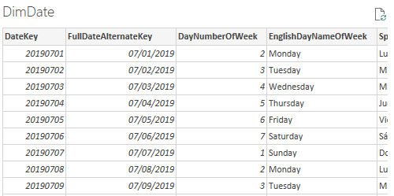
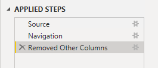
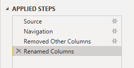
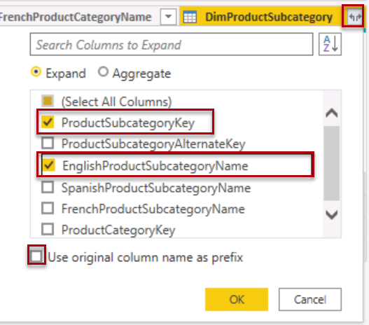

---
lab:
  title: Creación de un modelo de esquema de estrella
  module: Prepare data for tabular models in Power BI
---

# Creación de un modelo de esquema de estrella

## Información general

**El tiempo estimado para completar el laboratorio es de 30 minutos**

En este laboratorio, usarás Power BI Desktop para desarrollar un modelo de datos a través del almacenamiento de datos de Azure Synapse Adventure Works. El modelo de datos te permitirá publicar una capa semántica en el almacenamiento de datos.

En este laboratorio, aprenderá a:

- Crear una conexión Power BI a un grupo de SQL de Azure Synapse Analytics

- Desarrollar consultas de modelo.

- Organizar el diagrama del modelo.

## Introducción

En este ejercicio, prepara el entorno.

### Carga de datos en Azure Synapse Analytics

   > **Nota**: Si ya cargaste datos en Azure Synapse Analytics mediante un clon de Git, puedes omitir esta tarea y continuar con **Configuración de Power BI.**

1. Inicia sesión en [Azure Portal](https://portal.azure.com) con las credenciales de tu organización (o las que se te hayan proporcionado).
2. Usa el botón **[\>_]** situado a la derecha de la barra de búsqueda en la parte superior de la página para crear una nueva instancia de Cloud Shell en Azure Portal, para lo que deberás seleccionar un entorno de ***PowerShell*** y crear almacenamiento si se solicita. Cloud Shell proporciona una interfaz de línea de comandos en un panel situado en la parte inferior de Azure Portal, como se muestra a continuación:

    

    > **Nota**: si creaste anteriormente un Cloud Shell que usa un entorno de *Bash*, usa el menú desplegable situado en la parte superior izquierda del panel de Cloud Shell para cambiarlo a ***PowerShell***.

3. Ten en cuenta que puedes cambiar el tamaño de Cloud Shell arrastrando la barra de separación en la parte superior del panel, o usando los iconos **&#8212;** , **&#9723;** y **X** en la parte superior derecha para minimizar, maximizar y cerrar el panel. Para obtener más información sobre el uso de Azure Cloud Shell, consulta la [documentación de Azure Cloud Shell](https://docs.microsoft.com/azure/cloud-shell/overview).

4. En el terminal escribe el siguiente comando para clonar este repositorio:

    ```
    rm -r dp500 -f
    git clone https://github.com/MicrosoftLearning/DP-500-Azure-Data-Analyst dp500
    ```

5. Una vez clonado el repositorio, escribe los siguientes comandos para cambiar a la carpeta **setup** y ejecuta el script **setup.ps1** que contiene:

    ```
    cd dp500/Allfiles/04
    ./setup.ps1
    ```

6. Cuando se te solicite, escribe una contraseña adecuada que se va a establecer para el grupo de SQL de Azure Synapse.

    > **Nota**: Asegúrate de recordar esta contraseña.

7. Espera a que se complete el script: esto suele tardar unos 20 minutos; pero en algunos casos puede tardar más tiempo.
8. Después de crear el área de trabajo de Synapse y el grupo de SQL y cargar los datos, el script pausa el grupo para evitar cargos innecesarios de Azure. Cuando estés listo para trabajar con los datos en Azure Synapse Analytics, deberás reanudar el grupo de SQL.

### Clonación del repositorio para este curso

1. En el menú de inicio, abre el símbolo del sistema

    
2. En la ventana del símbolo del sistema, ve a la unidad D escribiendo:

    `d:`

   Presione Entrar.

    

3. En la ventana del símbolo del sistema, escribe el siguiente comando para descargar los archivos del curso y guardarlos en una carpeta denominada DP500.

   `git clone https://github.com/MicrosoftLearning/DP-500-Azure-Data-Analyst DP500`

4. Cuando se haya clonado el repositorio, abre la unidad D en el explorador de archivos para asegurarte de que se han descargado los archivos.

### Configuración de Power BI

En esta tarea, establecerás las opciones de Power BI.

1. Para abrir Power BI Desktop, en la barra de tareas, selecciona el acceso directo de **Power BI Desktop**.

2. Selecciona **X**, situada en la esquina superior derecha, para cerrar la ventana de introducción.

3. En la esquina superior derecha de Power BI Desktop, si aún no has iniciado sesión, selecciona **Iniciar sesión**. Utiliza las credenciales de tu organización (o las credenciales de laboratorio que se te hayan proporcionado) para completar el proceso de inicio de sesión.

4. Se te redirigirá a la página de registro de Power BI en Microsoft Edge. Selecciona **Continuar** para completar el registro.

   

5. Escribe un número de teléfono de 10 dígitos y selecciona **Comenzar**. Selecciona **Comenzar** una vez más. Se te redirige a Power BI.

6. En la parte superior derecha selecciona el icono de perfil y después selecciona **Iniciar prueba**.

   

7. Cuando se te solicite, selecciona **Iniciar prueba**.

8. Realiza las tareas restantes para completar la configuración de prueba.

   *Sugerencia: la experiencia del explorador web de Power BI se conoce como el **servicio Power BI**.*

9. Selecciona Áreas de trabajo, y **Crear un área de trabajo**.

    

10. Crea un área de trabajo denominada DP500 labs y selecciona **Guardar**.

    *Nota: El nombre del área de trabajo debe ser único dentro del inquilino. Si recibes un error, cambia el nombre del área de trabajo.*

11. Vuelve a Power BI Desktop. Si ves **Iniciar sesión** en la esquina superior derecha de la pantalla, vuelve a iniciar sesión con las credenciales proporcionadas en la pestaña Recursos del entorno de laboratorio. Si ya habías iniciado sesión, continúa con el paso siguiente.

12. Desplázate a Power BI Desktop y selecciona **Archivo**, **Opciones y configuración**, después, **Opciones**, **Seguridad** y, en Explorador de autenticación, activa **Usar mi navegador predeterminado** y selecciona **Aceptar**. Cierre Power BI Desktop. No guardes el archivo.

    *Volverás a abrir Power BI Desktop en el ejercicio siguiente.*

### Iniciar el grupo de SQL

En esta tarea, iniciarás el grupo de SQL.

1. En Microsoft Edge, desplázate a [https://portal.azure.com](https://portal.azure.com/).

1. Usa las credenciales del laboratorio para completar el proceso de inicio de sesión.

1. Selecciona **Azure Synapse Analytics** en los servicios de Azure. Seleccione el área de trabajo de Synapse.

   

1. Busca y selecciona el grupo de SQL dedicado.

   

1. Reanuda el grupo de SQL.

   

   *Importante: el grupo de SQL es un recurso costoso. Limita el uso de este recurso al trabajar en este laboratorio. La tarea final de este laboratorio te indicará que pauses el recurso.*

### Conectarse al área de trabajo de Power BI de Azure Synapse Analytics

En esta tarea, vincularás el área de trabajo de Power BI existente a tu área de trabajo de Azure Synapse Analytics.

1. En el grupo de SQL dedicado de Azure Portal, selecciona **Abrir en Synapse Studio** en la cinta de opciones.

1. En la página principal de Azure Synapse Studio, selecciona **Visualizar** para vincular el área de trabajo de Power BI.

   

1. En la lista desplegable **Nombre del área de trabajo**, selecciona el área de trabajo que creaste en la tarea anterior y selecciona **Crear**.

 


1. Desplázate a **Administrar** y selecciona **Publicar todo** para asegurarte de que se publican los cambios.

## Desarrollar un modelo de datos

En este ejercicio, desarrollarás un modelo de DirectQuery para admitir el análisis de Power BI y los informes del sujeto de ventas del revendedor del almacenamiento de datos.

### Descarga de un archivo de conjunto de datos

En esta tarea, descargarás un archivo de origen de datos de Power BI desde Synapse Studio.

1. En **Synapse Studio**, en la izquierda, selecciona el centro **Desarrollar**.

 

2. En el panel **Desarrollar**, expande **Power BI**, expande el área de trabajo y, después, selecciona **Conjuntos de datos de Power BI**. Si no está presente, haz en **Publicar todo** para publicar el área de trabajo y actualizar el explorador.

 

 *Nota: Si no ves ningún dato aquí, confirma que el grupo de SQL dedicado se está ejecutando y que tu área de trabajo de Power BI esté vinculada al área de trabajo de Synapse.*

3. En el panel **Conjuntos de datos de Power BI**, selecciona **Nuevo conjunto de datos de Power BI**.

 

4. En el panel izquierdo, en la parte inferior, selecciona **Iniciar**.

 

5. Selecciona el grupo de SQL, **sqldw** y después selecciona **Continuar**.

 

6. Selecciona **Descargar** para descargar el archivo .pbids.

 

 *Un archivo .pbids contiene una conexión al grupo de SQL. Es una manera cómoda de iniciar el proyecto. Cuando se abra, creará una nueva solución de Power BI Desktop que ya almacena los detalles de conexión al grupo de SQL.*

7. Abre el archivo .pbids que has descargado.

 *Cuando se abra el archivo, se te pedirá que crees consultas mediante la conexión. Definirás esas consultas en la siguiente tarea.*

### Creación de consultas de modelo

En esta tarea, crearás cinco consultas de Power Query que se cargarán cada una como una tabla en el modelo.

1. En Power BI Desktop, en la ventana **Base de datos de SQL Server**, a la izquierda, selecciona **Cuenta Microsoft**.

 

2. Seleccione **Iniciar sesión**.

3. Inicia sesión con tus credenciales de Azure del laboratorio.

4. Seleccione **Conectar**.

 

5. En la ventana **Navegador**, selecciona (no comprobar) la tabla **DimDate**.

6. En el panel derecho, observa el resultado de la vista previa, que muestra un subconjunto de las filas de la tabla.

 

7. Para crear consultas (que se convertirán en tablas de modelo), comprueba las siguientes siete tablas:

- DimDate

- DimProduct
  
- DimProductCategory
  
- DimProductSubcategory

- DimReseller

- DimSalesTerritory

- FactResellerSales

8. Para aplicar transformaciones a las consultas, en la parte inferior derecha, selecciona **Transformar datos**.

 

 *La transformación de los datos permite definir qué datos estarán disponibles en el modelo.*

9. En la ventana **Configuración de conexión**, selecciona la opción **DirectQuery**.

 

 *Esta decisión es importante. DirectQuery es un modo de almacenamiento. Una tabla de modelo que usa el modo de almacenamiento DirectQuery no almacena datos. Por lo tanto, cuando un objeto visual de informe de Power BI consulta una tabla DirectQuery, Power BI envía una consulta nativa al origen de datos. Este modo de almacenamiento se puede usar para grandes almacenes de datos como Azure Synapse Analytics (ya que podría ser poco práctico o poco económico importar grandes volúmenes de datos) o cuando se requieren resultados casi en tiempo real.*

10. Seleccione **Aceptar**.

 

11. En la ventana **Editor de Power Query**, en el panel **Consultas** (ubicado a la izquierda), observa que hay una consulta para cada tabla que has comprobado.

 *Ahora revisarás la definición de cada consulta. Cada consulta se convertirá en una tabla de modelo cuando se aplique al modelo. Ahora cambiarás el nombre de las consultas, por lo que se describen de manera más fácil y concisa, y aplicarás transformaciones para proporcionar las columnas necesarias para los requisitos de informes conocidos.*

12. Selecciona la consulta **DimDate**.

 

13. Para cambiar el nombre de la consulta, en el panel **Configuración de la consulta** (situado a la derecha), en el cuadro **Nombre**, reemplaza el texto por **Date** y luego presiona **Entrar**.

 

14. Para quitar columnas innecesarias, en la ficha de cinta **Inicio**, desde dentro del grupo **Administrar columnas**, selecciona el icono **Elegir columnas**.

 

15. En la ventana **Elegir columnas**, para desactivar todas las casillas, desactiva la primera casilla.

 

16. Comprueba las cinco columnas siguientes.

- DateKey

- FullDateAlternateKey

- EnglishMonthName

- FiscalQuarter

- FiscalYear

 

 *Esta selección de columnas determina qué estará disponible en tu modelo.*

17. Seleccione **Aceptar**.

 

18. En el  panel **Configuración de consulta**, en la lista **Pasos aplicados**, observa que se agregó un paso para quitar otras columnas.

 

 *Power Query define los pasos para lograr la estructura y los datos deseados. Cada transformación es un paso en la lógica de consulta.*

19. Para cambiar el nombre de la columna **FullDateAlternateKey**, haz doble clic en el encabezado de columna **FullDateAlternateKey**.

20. Reemplaza el texto por **Date** y luego presiona **Entrar**.

 

21. Observa que se agrega un nuevo paso aplicado a la consulta.

 

22. Cambiar el nombre de las columnas siguientes:

- **EnglishMonthName** como **Mes**

- **FiscalQuarter** como **Trimestre**

- **FiscalYear** como **Año**

23. Para validar el diseño de la consulta, en la barra de estado (ubicada a lo largo de la parte inferior de la ventana), comprueba que la consulta tiene cinco columnas.

 

 *Importante: Si el diseño de la consulta no coincide, revisa los pasos del ejercicio para realizar correcciones.*

 *Ahora se ha completado el diseño de la consulta **Date**.*

24. En el panel **Pasos aplicados**, haz clic con el botón derecho en el último paso y, después, selecciona **Ver consulta nativa**.

 

25. En la ventana **Consulta nativa**, revisa la instrucción SELECT que refleja el diseño de la consulta.

 *Este concepto es importante. Una consulta nativa es lo que Power BI usa para consultar el origen de datos. Para garantizar el mejor rendimiento, el desarrollador de bases de datos debe asegurarse de que esta consulta está optimizada mediante la creación de índices adecuados, etc.*

26. Para cerrar la ventana **Consulta nativa**, selecciona **Aceptar**.

 

27. Selecciona la tabla **DimProductCategory**.

28. Cambia el nombre de la consulta a **Product Details**.

29. Después, selecciona **Combinar consultas** en el grupo Combinar de la pestaña Inicio de la cinta.

 *Nota: Estamos combinando consultas para obtener los detalles del producto, la categoría y la subcategoría. Esto se usará en la dimensión de producto.*

30. Selecciona la tabla **DimProductSubcategory** y selecciona la columna **ProductCategoryKey** de cada tabla. Seleccione **Aceptar**.

 

 *Nota: Usa la combinación predeterminada para esta combinación, que es una combinación externa izquierda.*

31. Expande la columna **DimProductSubcategory**. Selecciona las columnas **ProductSubcategoryKey** y **EnglishProductSubcategoryName**. Desactiva la opción **Usar el nombre de columna original como prefijo**.

 

 *La característica Expandir permite combinar tablas basadas en restricciones de clave externa en los datos de origen. El enfoque de diseño adoptado por este laboratorio es combinar tablas de dimensiones de copo de nieve para generar una representación desnormalizada de los datos.*

32. Seleccione **Aceptar**.

33. Cambia el nombre de la columna **DimProductSubcategory.ProductSubcategoryKey** por **ProductSubcategoryKey** y **DimProductSubcategory.EnglishProductSubcategoryName** por **EnglishProductSubcategoryName**.

34. Elimine todas las columnas, excepto las siguientes:

   - ProductSubcategoryKey

   - EnglishProductCategoryName

   - EnglishProductSubcategoryName

   Ahora deberías tener tres columnas con 37 filas.

35. Seleccione la consulta **DimProduct**.

 

36. Cambia el nombre de la consulta a **Product**.

 

37. Después, selecciona **Combinar consultas** en el grupo Combinar de la pestaña Inicio de la cinta.

38. Selecciona la tabla **Detalles del producto** y selecciona la columna **ProductSubcategoryKey** tanto en la tabla Producto como en la tabla Detalles del producto.

    

39. Seleccione **Aceptar**.

40. Expande la columna Detalles del producto y selecciona las columnas **EnglishProductSubcategoryName** y **EnglishProductCategoryName**.

    

41. Seleccione **Aceptar**.

42. Para filtrar la consulta, en el encabezado de columna **FinishedGoodsFlag**, abre el menú desplegable y desactiva la opción **FALSE**.

 

43. Seleccione **Aceptar**.

44. Cambiar el nombre de las columnas siguientes:

- **EnglishProductName** como **Producto**

- **Product Details.EnglishProductCategoryName** como **Category**

- **Product Details.EnglishProductSubcategoryName** como **SubCategory**

45. Elimine todas las columnas, excepto las siguientes:

- ProductKey

- Producto

- Color

- Subcategoría

- Category

46. En el panel **Pasos aplicados**, haz clic con el botón derecho en el último paso y, después, selecciona **Ver consulta nativa**.

 

47. En la ventana **Consulta nativa**, revisa la instrucción SELECT que refleja el diseño de la consulta.

48. Para cerrar la ventana **Consulta nativa**, selecciona **Aceptar**.

49. Comprueba que la consulta tiene cinco columnas.

 *El diseño de la consulta **Producto** ya está completo.*

50. Seleccione la consulta **DimReseller**.

 

51. Cambia el nombre de la consulta a **Reseller**.

52. Elimine todas las columnas, excepto las siguientes:

- ResellerKey

- BusinessType

- ResellerName

53. Cambiar el nombre de las columnas siguientes:

- **BusinessType** por **Tipo de negocio**

- **ResellerName** por **Reseller**

54. Comprueba que la consulta tiene tres columnas.

 *Ahora se ha completado el diseño de la consulta **Reseller***.

55. Seleccione la consulta **DimSalesTerritory**.

 

56. Cambia el nombre de la consulta como **Territory**.

57. Elimine todas las columnas, excepto las siguientes:

- SalesTerritoryKey

- SalesTerritoryRegion

- SalesTerritoryCountry

- SalesTerritoryGroup

58. Cambiar el nombre de las columnas siguientes:

- **SalesTerritoryRegion** por **Región**

- **SalesTerritoryCountry** por **País**

- **SalesTerritoryGroup** por **Grupo**

59. Comprueba que la consulta tiene cuatro columnas.

 *El diseño de la consulta **Territory** ya está completo.*

60. Seleccione la consulta **FactResellerSales**.

 

61. Cambia el nombre de la consulta a **Sales**.

62. Elimine todas las columnas, excepto las siguientes:

- ResellerKey

- ProductKey

- OrderDateKey

- SalesTerritoryKey

- OrderQuantity

- UnitPrice

 

63. Cambiar el nombre de las columnas siguientes:

- **OrderQuantity** por **Cantidad**

- **UnitPrice** por **Precio**

64. Para crear una columna calculada, en la ficha de cinta **Agregar columna**, desde el grupo **General**, selecciona **Columna personalizada**.

 

65. En la ventana **Columna personalizada**, en el cuadro **Nuevo nombre de columna**, reemplaza el texto por **Ingresos**.

 

66. En el cuadro **Fórmula de columna personalizada**, especifica la fórmula siguiente:

 ```
 [Quantity] * [Price]
 ```

67. Seleccione **Aceptar**.

68. Para modificar el tipo de datos de columna, en el encabezado de columna **Ingresos**, selecciona **ABC123** y después selecciona **Número decimal**.

 

69. Revisa la consulta nativa, observando la lógica de cálculo de la columna **Ingresos**.

70. Comprueba que la consulta tiene siete columnas.

 *El diseño de la consulta **Sales** ya está completo.*

71. Haz clic con el botón derecho en la tabla **Detalles del producto** y selecciona **Habilitar carga**. Esto deshabilitará la carga de la tabla Detalles del producto en el modelo de datos y no aparecerá en el informe.

 

72. Repite este paso, anulando la selección de Habilitar carga, para la tabla **DimProductSubcategory**.

73. Para aplicar las consultas en la ficha de cinta **Inicio**, desde el grupo **Cerrar**, selecciona el icono **Cerrar &amp; Aplicar**.

 

 *Cada consulta se aplica para crear una tabla de modelo. Dado que la conexión de datos usa el modo de almacenamiento DirectQuery, solo se crea la estructura del modelo. No se importan datos. El modelo ahora consta de una tabla para cada consulta.*

74. En Power BI Desktop, cuando se hayan aplicado las consultas, en la esquina inferior izquierda de la barra de estado, observa que el modo de almacenamiento del modelo es DirectQuery.

 

### Organización del diagrama del modelo

En esta tarea, organizarás el diagrama de modelos para comprender fácilmente el diseño del esquema de estrella.

1. En Power BI Desktop, en la parte izquierda, selecciona la vista **Modelo**.

 

2. Para cambiar el tamaño del diagrama de modelos para que se ajuste a la pantalla, en la parte inferior derecha, selecciona el icono **Ajustar a pantalla**.

 

3. Arrastrae las tablas a la posición para que la tabla de hechos **Sales** se encuentre en el centro del diagrama y las tablas restantes, que son tablas de dimensiones, se encuentran alrededor de la tabla de hechos.

4. Si alguna de las tablas de dimensiones no está relacionada con la tabla de hechos, sigue estas instrucciones para crear una relación:

- Arrastra la columna de clave de dimensión (por ejemplo, **ProductKey**) y colócala en la columna correspondiente de la tabla **Sales**.

- En la ventana **Crear relación**, selecciona **Aceptar**.

5. Revisa el diseño final del diagrama del modelo.

 

 *Ahora se ha completado la creación del modelo de esquema de estrella. Hay muchas configuraciones de modelado que ahora se podrían aplicar, como agregar jerarquías, cálculos y establecer propiedades como visibilidad de columnas.*

6. Para guardar la solución, en la parte superior izquierda, selecciona el menú **Archivo** y, en él, selecciona **Guardar como**.

7. En la ventana **Guardar como**, ve a la carpeta **D:\DP500\Allfiles\04\MySolution**.

8. En el cuadro **Nombre de archivo**, escriba **Sales Analysis** (Análisis de ventas).

 

9. Seleccione **Guardar**.

10. Cierre Power BI Desktop.

### Pausar el grupo de SQL

En esta tarea, detendrás el grupo de SQL.

1. En un explorador web, vaya a [https://portal.azure.com](https://portal.azure.com/).

2. Crea el grupo de SQL.

3. Pausa el grupo de SQL.
