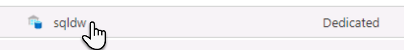
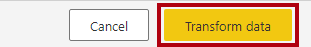
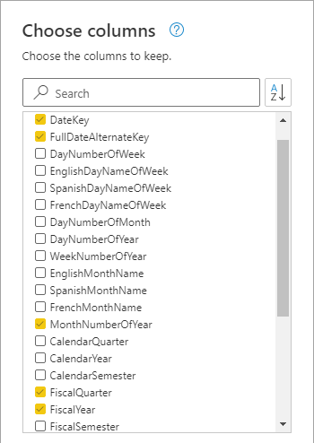
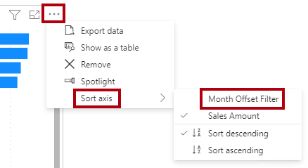

---
lab:
  title: Crear un flujo de datos
  module: Prepare data for tabular models in Power BI
---

# Crear un flujo de datos

## Información general

**El tiempo estimado para completar el laboratorio es de 45 minutos.**

En este laboratorio, crearás un flujo de datos para entregar datos de dimensión de fecha procedentes del almacenamiento de datos de Azure Synapse Adventure Works. El flujo de datos proporcionará una definición coherente de los datos relacionados con la fecha para su uso por parte de los analistas de negocios de la organización.

En este laboratorio, aprenderá a:

- Usa Power Query Online para desarrollar un flujo de datos.

- Usa Power BI Desktop para consumir un flujo de datos.

## Introducción

En este ejercicio prepararás el entorno.

### Carga de datos en Azure Synapse Analytics

   > **Nota**: Si ya cargaste datos en Azure Synapse Analytics mediante un clon de Git, puedes omitir esta tarea y continuar con **Configuración de Power BI.**

1. Inicia sesión en [Azure Portal](https://portal.azure.com) con la información de inicio de sesión que se encuentra en la pestaña Recursos del lado derecho de la máquina virtual.
2. Usa el botón **[\>_]** situado a la derecha de la barra de búsqueda en la parte superior de la página para crear una nueva instancia de Cloud Shell en Azure Portal, para lo que deberás seleccionar un entorno de ***PowerShell*** y crear almacenamiento si se solicita. Cloud Shell proporciona una interfaz de línea de comandos en un panel situado en la parte inferior de Azure Portal, como se muestra a continuación:

    

    > **Nota**: Si creaste anteriormente un Cloud Shell que usa un entorno de *Bash*, usa el menú desplegable situado en la parte superior izquierda del panel de Cloud Shell para cambiarlo a ***PowerShell***.

3. Tenga en cuenta que puede cambiar el tamaño de Cloud Shell arrastrando la barra de separación en la parte superior del panel, o usando los iconos **&#8212;** , **&#9723;** y **X** en la parte superior derecha para minimizar, maximizar y cerrar el panel. Para obtener más información sobre el uso de Azure Cloud Shell, consulte la [documentación de Azure Cloud Shell](https://docs.microsoft.com/azure/cloud-shell/overview).

4. En el terminal escribe el siguiente comando para clonar este repositorio:

    ```
    rm -r dp500 -f
    git clone https://github.com/MicrosoftLearning/DP-500-Azure-Data-Analyst dp500
    ```

5. Una vez clonado el repositorio, escribe los siguientes comandos para cambiar a la carpeta **setup** y ejecuta el script **setup.ps1** que contiene:

    ```
    cd dp500/Allfiles/04
    ./setup.ps1
    ```

6. Cuando se te solicite, escribe una contraseña adecuada que se va a establecer para el grupo de SQL de Azure Synapse.

    > **Nota**: Asegúrate de recordar esta contraseña.

7. Espera a que se complete el script: esto suele tardar unos 20 minutos; pero en algunos casos puede tardar más tiempo.

1. Después de crear el área de trabajo de Synapse y el grupo de SQL y cargar los datos, el script pausa el grupo para evitar cargos innecesarios de Azure. Cuando estés listo para trabajar con los datos en Azure Synapse Analytics, deberás reanudar el grupo de SQL.

### Clonación del repositorio para este curso

1. En el menú de inicio, abre el símbolo del sistema

    

1. En la ventana del símbolo del sistema, ve a la unidad D escribiendo:

    `d:` 

   Presione Entrar.

    


1. En la ventana del símbolo del sistema, escribe el siguiente comando para descargar los archivos del curso y guardarlos en una carpeta denominada DP500.
    
    `
    git clone https://github.com/MicrosoftLearning/DP-500-Azure-Data-Analyst DP500
    `
   
2. Cuando se haya clonado el repositorio, cierra la ventana del símbolo del sistema. 
   
3. Abre la unidad D en el explorador de archivos para asegurarte de que se han descargado los archivos.

### Configurar Power BI Desktop

En esta tarea configurarás Power BI Desktop.

1. Para abrir Explorador de archivos, en la barra de tareas, selecciona el acceso directo **Explorador de archivos**.

1. Ve a la carpeta **D:\DP500\Allfiles\05\Starter**.

1. Para abrir un archivo de Power BI Desktop desarrollado previamente, haz doble clic en el archivo **Sales Analysis - Create a dataflow.pbix**.

1. Si aún no has iniciado sesión, en la esquina superior derecha de Power BI Desktop, selecciona **Iniciar sesión**. Usa las credenciales del laboratorio para completar el proceso de inicio de sesión.

    

1. Para guardar el archivo, en la cinta **Archivo**, selecciona **Guardar como**.

1. En la ventana **Guardar como**, ve a la carpeta **D:\DP500\Allfiles\05\MySolution**.

1. Ve a Power BI Desktop y selecciona **Archivo**, **Opciones y configuración**, **Opciones**, **Seguridad** y, en Explorador de autenticación, activa **Usar mi navegador predeterminado** y selecciona **Guardar**.

    *Actualizarás la solución de Power BI Desktop para usar un flujo de datos para los datos de dimensión de fecha de origen.*

### Inicio de sesión en el servicio Power BI

En esta tarea iniciarás sesión en el servicio Power BI, iniciarás una licencia de prueba y crearás un área de trabajo.

*Importante: si ya has configurado Power BI en el entorno de máquina virtual, continúa con la siguiente tarea.*

1. En un explorador web, vaya a [https://powerbi.com](https://powerbi.com/).

1. Usa las credenciales del laboratorio para completar el proceso de inicio de sesión.

    *Importante: debes usar las mismas credenciales que se usan para iniciar sesión desde Power BI Desktop.*

1. En la parte superior derecha selecciona el icono de perfil y después selecciona **Iniciar prueba**.

    

1. Cuando se te solicite, selecciona **Iniciar prueba**.


2. Realiza las tareas restantes para completar la configuración de prueba.

    *Sugerencia: la experiencia del explorador web de Power BI se conoce como el **servicio Power BI**.*

9. Selecciona Áreas de trabajo, y **Crear un área de trabajo**.

    

10. Crea un área de trabajo denominada DP500 labs y selecciona **Guardar**.

    *Nota: El nombre del área de trabajo debe ser único dentro del inquilino. Si recibes un error, cambia el nombre del área de trabajo.*

Una vez creada, el área de trabajo se abre. En un ejercicio posterior crearás un flujo de datos para esta área de trabajo.

### Iniciar el grupo de SQL

En esta tarea, iniciarás el grupo de SQL.

1. En un explorador web, vaya a [https://portal.azure.com](https://portal.azure.com/).

1. Usa las credenciales del laboratorio para completar el proceso de inicio de sesión.

1. Usa la barra de búsqueda para buscar Azure Synapse Analytics. 

1. Selecciona la instancia de Azure Synapse Analytics.
    

1. Busca y selecciona el grupo de SQL dedicado.
    

1. Reanuda el grupo de SQL dedicado.

    

    *Importante: el grupo de SQL es un recurso costoso. Limita el uso de este recurso al trabajar en este laboratorio. La tarea final de este laboratorio te indicará que pauses el recurso.*

## Desarrollo de un flujo de datos

En este ejercicio, desarrollarás un flujo de datos para admitir el desarrollo de modelos de Power BI. Proporcionarás una representación coherente de la tabla de dimensiones de fecha del almacenamiento de datos.

### Revisión del modelo de datos

En esta tarea revisarás el modelo de datos desarrollado en Power BI Desktop.

1. Cambia a la solución de Power BI Desktop.

1. A la izquierda, cambia a la vista **Modelo**.

    

1. En el diagrama del modelo, observa la tabla **Fecha**.

    

    *El analista de negocios creó la tabla **Date**. No representa una definición coherente de datos relacionados con fechas y no incluye columnas de desplazamiento útiles para admitir filtros de fecha relativos. En un ejercicio posterior reemplazarás esta tabla por una nueva tabla de origen de un flujo de datos.*

### Crear un flujo de datos

En esta tarea, crearás un flujo de datos que representa una definición coherente de datos relacionados con fechas.

1. En el servicio Power BI selecciona **Nuevo**, **Flujo de datos**.

    

1. En la ventana **Definir nuevas tablas**, selecciona **Agregar nuevas tablas**.

    

    *La adición de nuevas tablas implica usar Power Query Online para definir consultas.*

1. Para elegir un origen de datos, selecciona **Azure Synapse Analytics (SQL DW)**.

    

    *Sugerencia: puedes usar el cuadro de búsqueda (ubicado en la parte superior derecha) para ayudar a encontrar el origen de datos.*

1. Especifica la configuración de conexión de Synapse.

     - Escribe el nombre del servidor disponible en Azure Portal.
     
     
     
      El nombre del servidor debe tener un aspecto similar al siguiente:
      
      synapsewsxxxxx.sql.azuresynapse.net
      
     - Selecciona **Cuenta de organización** en el campo Tipo de autenticación. Si se te pide que inicies sesión, usa las credenciales proporcionadas para el laboratorio.
     

1. Selecciona **Siguiente** en la parte inferior derecha.

    

1. En el panel de navegación de Power Query, expande sqldw y selecciona (no comprobar) la tabla **DimDate**.

    

1. Observa la vista previa de los datos de tabla.

1. Para crear una consulta, comprueba la tabla **DimDate**.

    

1. En la parte inferior derecha, selecciona **Transformar datos**.

    

    *Power Query Online ahora se usará para aplicar transformaciones a la tabla. Proporciona una experiencia casi idéntica a la de Editor de Power Query en Power BI Desktop.*

1. Para cambiar el nombre de la consulta, en el panel **Configuración de la consulta** (situado a la derecha), en el cuadro **Nombre**, reemplaza el texto por **Date** y luego presiona **Entrar**.

    

1. Para quitar columnas innecesarias, en la ficha de cinta **Inicio**, desde dentro del grupo **Administrar columnas**, selecciona el icono **Elegir columnas**.

    

1. En la ventana **Elegir columnas**, para desactivar todas las casillas, desactiva la primera casilla.

    


1. Comprueba las cinco columnas siguientes.

    - DateKey

    - FullDateAlternateKey

    - MonthNumberOfYear

    - FiscalQuarter

    - FiscalYear

    

1. Seleccione **Aceptar**.

    

  
1. En el  panel **Configuración de consulta**, en la lista **Pasos aplicados**, observa que se agregó un paso para quitar otras columnas.

    

    *Power Query define los pasos para lograr la estructura y los datos deseados. Cada transformación es un paso en la lógica de consulta.*

1. Para cambiar el nombre de la columna **FullDateAlternateKey**, haz doble clic en el encabezado de columna **FullDateAlternateKey**.

1. Reemplaza el texto por **Date** y luego presiona **Entrar**.

    

1. Para crear una columna calculada, en la ficha de cinta **Agregar columna**, desde el grupo **General**, selecciona **Columna personalizada**.

    

   

1. En la ventana **Columna personalizada**, en el cuadro **Nuevo nombre de columna**, reemplaza el texto por **Year**.

1. En la lista desplegable **Tipo de datos**, selecciona **Texto**.

    

1. En el cuadro **Fórmula de columna personalizada**, escribe la fórmula siguiente:

    *Sugerencia: todas las fórmulas están disponibles para copiar y pegar desde **D:\DP500\Allfiles\05\Assets\Snippets.txt**.*


    ```
    "FY" & Number.ToText([FiscalYear])
    ```


1. Seleccione **Aceptar**.

    *Ahora agregarás cuatro columnas personalizadas más.*

1. Agrega otra columna personalizada denominada **Quarter** con el tipo de datos **Texto** mediante la fórmula siguiente:


    ```
    [Year] & " Q" & Number.ToText([FiscalQuarter])
    ```


1. Agrega otra columna personalizada denominada **Month** con el tipo de datos **Texto** mediante la fórmula siguiente:


    ```
    Date.ToText([Date], "yyyy-MM")
    ```

1. Agrega otra columna personalizada denominada **Month Offset** (incluye un espacio entre las palabras) con el tipo de datos **Número entero** mediante la fórmula siguiente:


    ```
    ((Date.Year([Date]) * 12) + Date.Month([Date])) - ((Date.Year(DateTime.LocalNow()) * 12) + Date.Month(DateTime.LocalNow()))
    ```


    *Esta fórmula determina el número de meses desde el mes actual. El mes actual es cero, los meses en el pasado son negativos y los meses en el futuro son positivos. Por ejemplo, el último mes tiene un valor de -1.*

   

1. Agrega otra columna personalizada denominada **Month Offset Filter** (incluye espacios entre las palabras) con el tipo de datos **Texto**, mediante la fórmula siguiente:


    ```
    if [Month Offset] > 0 then Number.ToText([Month Offset]) & " month(s) future"

    else if [Month Offset] = 0 then "Current month"

    else Number.ToText(-[Month Offset]) & " month(s) ago"
    ```


    *Esta fórmula transpone el desplazamiento numérico a un formato de texto descriptivo.*

    *Sugerencia: todas las fórmulas están disponibles para copiar y pegar desde **D:\DP500\Allfiles\05\Assets\Snippets.txt**.*

1. Para quitar columnas innecesarias, en la ficha de cinta **Inicio**, desde dentro del grupo **Administrar columnas**, selecciona el icono **Elegir columnas**.

    

1. En la ventana **Elegir columnas**, para desactivar las columnas siguientes:

    - MonthNumberOfYear

    - FiscalQuarter

    - FiscalYear

    

1. Seleccione **Aceptar**.

1. Selecciona **Guardar &amp; Cerrar**.

    

1. En la ventana **Guardar el flujo de datos**, en el cuadro **Nombre**, escribe **Corporate Date**.

1. En el cuadro **Descripción**, escribe: **Consistent date definition for use in all Adventure Works datasets**.

1. Sugerencia: la descripción está disponible para copiar y pegar desde **D:\DP500\Allfiles\05\Assets\Snippets.txt**.

    

1. Seleccione **Guardar**.

    

1. En el servicio Power BI, en el panel **Navegación**, selecciona el nombre de tu área de trabajo.

    *Esta acción abre la página de aterrizaje del área de trabajo.*

1. Para actualizar el flujo de datos, mantén el cursor sobre el flujo de datos **Corporate Date** y luego selecciona el icono **Actualizar ahora**.

    

  

1. Para ir a la configuración del flujo de datos, mantén el cursor sobre el flujo de datos**Corporate Date**, selecciona los puntos suspensivos y después selecciona **Configuración**.

    

1. Revisa las opciones de configuración.

    

    *Hay dos opciones que deben configurarse. En primer lugar, la actualización programada debe configurarse para actualizar los datos del flujo de datos todos los días. De este modo, los desplazamientos de mes se calcularán con la fecha actual. En segundo lugar, el flujo de datos debe aprobarse como certificado (por un revisor autorizado). Un flujo de datos certificado declara a otros usuarios que cumplen los estándares de calidad y se pueden considerar confiables y autoritativos.*

    *Además de configurar las opciones, se debe conceder permiso a todos los creadores de contenido para consumir el flujo de datos.*

## Consumo de un flujo de datos

En este ejercicio, en la solución Power BI Desktop, reemplazarás la tabla **Date** existente por una nueva tabla que obtiene sus datos del flujo de datos.

### Quitar la tabla Date original

En esta tarea, quitarás la tabla **Date**.

1. Cambia a la solución de Power BI Desktop.

1. En el diagrama del modelo, haz clic con el botón derecho en la tabla **Date** y selecciona **Eliminar del modelo**.

    

1. Cuando se te pregunte si quieres eliminar la página, selecciona **Aceptar**.

    

  


### Agregar una tabla de fechas nueva

En esta tarea, agregarás una nueva tabla **Fecha** que origine sus datos del flujo de datos.

1. En la cinta **Inicio**, en el grupo **Datos**, selecciona el icono **Obtener datos**.

    

1. En la ventana **Obtener datos**, a la izquierda, selecciona **Power Platform** y después selecciona **Flujos de datos de Power BI**.

    

1. Seleccione **Conectar**.

    

  

1. En la ventana **Flujos de datos de Power BI**, selecciona **Iniciar sesión**.

    

1. Usa las credenciales del laboratorio para completar el proceso de inicio de sesión.

    *Importante: Debes usar las mismas credenciales que se usaron para iniciar sesión en el servicio Power BI.*

1. Seleccione **Conectar**.

    

1. En la ventana **Navegador**, en el panel izquierdo, expande la carpeta del área de trabajo y después expande la carpeta de flujo de datos **Fecha corporativa**.

    


1. Comprueba la tabla **Fecha**.

    

1. Seleccione **Cargar**.

    

    *Es posible transformar los datos mediante el Editor de Power Query.*

1. Cuando se haya agregado la nueva tabla al modelo, crea una relación arrastrando la columna **DateKey** de la tabla **Date** a la columna **OrderDateKey** de la tabla **Sales**.

    

    *Hay muchas otras configuraciones de modelo, como ocultar columnas o crear una jerarquía, que se pueden realizar.*

### Validación del modelo

En esta tarea, probarás el modelo mediante la creación de un diseño de informe simple.

1. A la izquierda, cambia a la vista **Informe**.

    

1. Para agregar un objeto visual a la página, en el panel **Visualizaciones**, selecciona el tipo de objeto visual Gráfico de barras apiladas.

    

1. Cambia el tamaño del objeto visual para rellenar la página del informe.

  

1. En el panel **Datos**, expande la tabla **Fecha** y después arrastra el campo **Filtro de desplazamiento del mes** al objeto visual del gráfico de barras.

    

1. En el panel **Datos**, expande la tabla **Ventas** y después arrastra el campo **Importe de ventas** al objeto visual del gráfico de barras.

    


1. Para ordenar el eje vertical, en la parte superior derecha del objeto visual, selecciona los puntos suspensivos y después selecciona **Ordenar eje** > **Filtro de desplazamiento de mes**.

    

1. Para asegurarte de que los valores de filtro de desplazamiento del mes se ordenan cronológicamente, en el panel **Datos**, selecciona el campo **Filtro de desplazamiento de mes**.

1. En la ficha de cinta **Herramientas de columna**, en el grupo **Ordenar**, selecciona **Ordenar** y después **Desplazamiento de mes**.

    

1. Revisa el objeto visual de gráfico de barras actualizado que ahora se ordena cronológicamente.

    *La principal ventaja de usar columnas de desplazamiento de fecha es que los informes pueden filtrar por fechas relativas de forma personalizada. (Segmentaciones y filtros, y también filtrar por períodos de fecha y hora relativos, pero este comportamiento no se puede personalizar. Tampoco permiten el filtrado por trimestres).*

1. Guarde el archivo de Power BI Desktop.

1. Cierre Power BI Desktop.

### Pausar el grupo de SQL

En esta tarea, detendrás el grupo de SQL.

1. En un explorador web, vaya a [https://portal.azure.com](https://portal.azure.com/).

1. Crea el grupo de SQL.

1. Pausa el grupo de SQL.
