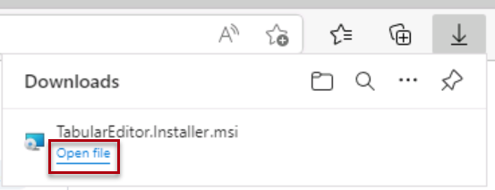
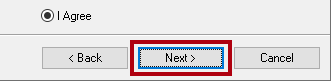
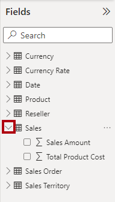
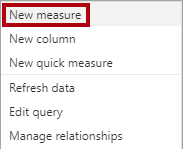
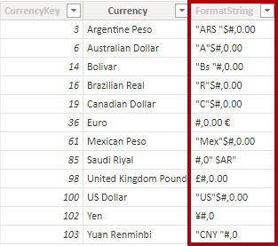

---
lab:
  title: Creación de grupos de cálculo
  module: Design and build tabular models
---
# Creación de grupos de cálculo

## Información general

El tiempo estimado para completar el laboratorio es de 45 minutos.

En este laboratorio usarás Power BI Desktop y Tabular Editor 2 para crear grupos de cálculo.

En este laboratorio, aprenderá a:

-   Crear grupos de cálculo.
-   Formatear elementos de cálculo.
-   Calcular prioridad de grupos de cálculo.
-   Configurar objetos visuales para usar grupos de cálculo.

## Introducción
### Clonación del repositorio para este curso

1. En el menú de inicio, abre el símbolo del sistema

    

1. En la ventana del símbolo del sistema, ve a la unidad D escribiendo:

    `d:` 

   Presione Entrar.

    


1. En la ventana del símbolo del sistema, escribe el siguiente comando para descargar los archivos del curso y guardarlos en una carpeta denominada DP500.
    
    `git clone https://github.com/MicrosoftLearning/DP-500-Azure-Data-Analyst DP500`
   
1. Cuando se haya clonado el repositorio, cierra la ventana del símbolo del sistema. 
   
1. Abre la unidad D en el explorador de archivos para asegurarte de que se han descargado los archivos.

## Preparación del entorno

Prepara el entorno de laboratorio mediante la instalación de Tabular Editor 2, la configuración de Power BI Desktop, la revisión del modelo de datos y la creación de medidas.

### Descarga e instalación del Tabular Editor 2

Descarga e instalación de Tabular Editor 2 para habilitar la creación de grupos de cálculo.

**Importante:***si ya has instalado Editor tabular 2 en tu entorno de máquina virtual, continúa con la siguiente tarea.*

*Tabular Editor es una herramienta alternativa de editor para crear modelos tabulares para Analysis Services y Power BI. Tabular Editor 2 es un proyecto de código abierto que puede editar un archivo BIM sin tener acceso a ningún dato del modelo.*

1.  Asegúrate de que Power BI Desktop está cerrado.

1.  En Microsoft Edge, ve a la página Tabular Editor Release.

    ```https://github.com/TabularEditor/TabularEditor/releases```
    
1. Desplázate hacia abajo hasta la sección **Activos** y selecciona el archivo **TabularEditor.Installer.msi**. Esto iniciará la instalación del archivo.

1. Tras finalizar, selecciona **Abrir archivo** para ejecutar el instalador.

    

1.  En la ventana de instalación de Tabular Editor, selecciona **Siguiente**.

    

1.  En el paso **Contrato de licencia**, si estás de acuerdo, selecciona **Acepto** y después **Siguiente**.

    

1.  En el paso **Seleccionar carpeta de instalación**, selecciona **Siguiente**.


2.  En el paso **Métodos abreviados de la aplicación**, selecciona **Siguiente**.


3. En el paso **Confirmar instalación**, selecciona **Siguiente**.

4. Si aparece una ventana emergente **Control de cuentas de usuario**, selecciona **Sí.**

5. Cuando se haya completado la instalación, seleccione **Cerrar**.

    *Tabular Editor ahora está instalado y registrado como una herramienta externa de Power BI Desktop.*

### Configurar Power BI Desktop

Ahora abrirás una solución de Power BI Desktop desarrollada previamente.

1.  En Explorador de archivos, ve a la carpeta **D:\\DP500\\Allfiles\\07\\Starter**.

2.  Para abrir un archivo de Power BI Desktop desarrollado previamente, haz doble clic en el archivo **Sales Analysis - Create calculation groups.pbix (Análisis de ventas: crear grupos de cálculo.pbix)**.

3.  Para guardar el archivo, en la ficha de cinta **Archivo**, selecciona **Guardar como**.

4.  En la ventana **Guardar como**, ve a la carpeta **D:\\DP500\\Allfiles\\07\\MySolution**.

5.  Seleccione **Guardar**.

6.  Selecciona la pestaña de cinta **Herramientas externas**.

    

7.  Observa que puedes iniciar Tabular Editor desde esta pestaña de cinta.

    

    *En el ejercicio siguiente, usarás el Tabular Editor para crear grupos de cálculo.*

### Revisión del modelo de datos

Revisión del modelo de datos para comprender cómo se aplicarán los grupos de cálculo a este modelo.

1.  En Power BI Desktop, en la parte izquierda, cambia a la vista **Modelo**.

    

2.  Usa el diagrama de modelos para revisar el diseño del modelo.

    

    *El modelo consta de siete tablas de dimensiones y dos tablas de hechos. La tabla de hechos **Ventas** almacena los detalles de los pedidos de ventas. La tabla de hechos **Tipo de moneda** almacena los tipos de moneda diarios de varias divisas. Es un diseño clásico de esquema de estrella.*

3.  Cambie a la vista **Informe**.

    

4.  En el panel **Datos** (situado a la derecha), expande la tabla **Ventas** para revisar los campos.

    

5.  Los dos campos de la tabla **Ventas** están representados con el símbolo sigma (∑).

    *El símbolo sigma indica que los campos se resumirán automáticamente con funciones de agregación, como suma, recuento, media u otras.*

    *Sin embargo, cuando se agregan grupos de cálculo a un modelo, este comportamiento automático debe deshabilitarse. Esto significa que el resumen solo se puede lograr mediante medidas, que se definen mediante fórmulas de expresiones de análisis de datos (DAX). En la siguiente tarea, agregarás medidas al modelo.*

### Crear medidas

Crea tres medidas relacionadas con las ventas como preparación para la creación de tus grupos de cálculo.

1.  En el panel **Datos**, haz clic con el botón derecho del ratón en la tabla **Ventas** y después selecciona **Nueva medida**.

    

2.  En la barra de fórmulas (situada debajo de la cinta), reemplaza el texto por la siguiente definición de medida y después presiona **Entrar**.

    Sugerencia: todas las fórmulas están disponibles para copiar y pegar desde **D:\\DP500\\Allfiles\\07\\Assets\\Snippets.txt**.

    DAX

    ```Sales = SUM ( 'Sales'[Sales Amount] )```

3.  En la cinta contextual **Herramientas de medición**, dentro del grupo **Formato**, establece las posiciones decimales en **2**.

    

4.  Cree y aplique un formato similar a una segunda medida denominada **Cost** mediante la siguiente definición:

    DAX

    ```Cost = SUM ( 'Sales'[Total Product Cost] )```

5.  Cree y aplique un formato similar a una tercera medida denominada **Profit** mediante la siguiente definición:

    DAX

    ```Profit = [Sales] - [Cost]```

6.  En el panel **Datos**, haz clic con el botón derecho en el campo **Importe de ventas** y después selecciona **Ocultar**.

    

7.  Oculte también el campo **Total Product Cost**.

8.  Observe que la tabla **Ventas** aparece ahora primero en el panel **Datos**, y está representada con un icono de calculadora múltiple.

    

    *Cuando una tabla solo consta de medidas visibles, se presenta en la parte superior del panel. De este modo, se comporta como un grupo de medida (un objeto de un modelo multidimensional). No confundas esta representación estética de un modelo tabular con grupos de cálculo DAX.*

## Creación de grupos de cálculo

Ahora crearás dos grupos de cálculo. El primero será compatible con la inteligencia de tiempo. El segundo será compatible con la conversión de moneda.

### Creación del grupo de cálculo de inteligencia de tiempo

Usa el Tabular Editor para crear el grupo de cálculo **Inteligencia de tiempo**. Simplificará la creación de muchos cálculos relacionados con el tiempo, incluidos PY (año anterior), YoY (año a año) y % YoY (porcentaje año a año). El grupo de cálculo le permitirá analizar cualquier medida con diferentes cálculos de inteligencia de tiempo.

*Power BI Desktop no admite la creación o administración de grupos de cálculo.*

   > **Sugerencia**: toda la sintaxis está disponible para copiar y pegar en D:\DP500\Allfiles\07\Assets\Snippets.txt.

1.  En la cinta **Herramientas externas**, seleccione **Tabular Editor**.

    

    *Tabular Editor se abre en una nueva ventana y se conecta en directo al modelo de datos hospedado en Power BI Desktop. Los cambios realizados en el modelo en Tabular Editor no se propagan a Power BI Desktop hasta que los guardes.*

2.  En la ventana Tabular Editor, en el panel izquierdo, haz clic con el botón derecho en la carpeta **Tablas** y después selecciona **Crear nuevo**\>**Grupo de cálculo**.

    

3.  En el panel de la izquierda, reemplaca el nombre predeterminado por **Inteligencia de tiempo** y después presiona **Entrar**.

4.  Luego, expande la tabla **Inteligencia del tiempo**.

5.  Seleccione la columna **Name**.

    

    *El grupo de cálculo consta de esta sola columna, mientras que las filas de datos definen el grupo de cálculos. Se recomienda cambiar el nombre de la columna para reflejar el asunto de los cálculos.*

6.  En el panel **Propiedades** (ubicado en la esquina inferior derecha), selecciona la propiedad **Nombre** y, después, cámbiale el nombre por **Cálculo de tiempo** 

    

7.  Para crear un elemento de cálculo, haga clic con el botón derecho en la tabla **Inteligencia de tiempo** y selecciona **Crear nuevo**\>**Elemento de cálculo**.

    

8.  En el panel de la izquierda, reemplaza el nombre predeterminado por **Actual** y después presiona **Entrar**.

9.  En el panel **Editor de expresiones** (ubicado encima del panel **Propiedades**), escriba la fórmula siguiente:

    DAX

    ```SELECTEDMEASURE ()```

    

    *La función SELECTEDMEASURE devuelve una referencia a la medida que está actualmente en contexto cuando se evalúa el elemento de cálculo.*

10. En la barra de herramientas del panel **Editor de expresiones**, selecciona el primer botón para aceptar los cambios.

    

11. Cree un segundo elemento de cálculo denominado **PY** mediante la fórmula siguiente:

    DAX

    ```CALCULATE ( SELECTEDMEASURE (), SAMEPERIODLASTYEAR ( 'Date'[Date] ) )```

    *La fórmula del año anterior (PY) calcula el valor de la medida seleccionada en el año anterior.*

12. Cree un tercer elemento de cálculo denominado **YoY** mediante la fórmula siguiente:

    DAX
    ```
    SELECTEDMEASURE () 
        - CALCULATE ( SELECTEDMEASURE (), 'Time Intelligence'[Time Calculation] = "PY" )
    ```

    *La fórmula año a año (YoY) calcula la diferencia de la medida seleccionada del año actual con el año anterior.*

13. Crea un cuarto elemento de cálculo denominado **YoY %** con la siguiente fórmula:

    DAX
    ```
    DIVIDE (
        CALCULATE ( SELECTEDMEASURE (), 'Time Intelligence'[Time Calculation] = "YoY" ),
        CALCULATE ( SELECTEDMEASURE (), 'Time Intelligence'[Time Calculation] = "PY" )
    )
    ```
    *La fórmula de porcentaje año a año (YoY %) calcula el cambio porcentual de la medida seleccionada durante el año anterior.*

14. En el panel **Propiedades**, establece la propiedad **Expresión de cadena de formato** en: 
    ```
    "0.00%;-0.00%;0.00%"
    ```

    Sugerencia: la expresión de cadena de formato está disponible para copiar y pegar desde **D:\\DP500\\Allfiles\\07\\Assets\\Snippets.txt**.

    

15. Compruebe que el grupo de cálculo **Time Intelligence** tiene cuatro elementos de cálculo.

    

16. Para guardar los cambios en el modelo de Power BI Desktop, en el menú **Archivo**, selecciona **Guardar**.

    

    **Sugerencia:***también es posible seleccionar el botón de la barra de herramientas o presionar **Ctrl+S**.*

17. Cambiar a Power BI Desktop.

18. Encima del diseñador de informes, observa el banner amarillo.

    

19. A la derecha del banner, selecciona **Actualizar ahora**.

    

    *La actualización aplica los cambios con la creación del grupo de cálculo como una tabla de modelos. Despúes, carga los elementos de cálculo como filas de datos.*

20. En el panel **Datos**, expande y abre la tabla **Inteligencia de tiempo**.

    

### Actualización del visual de matriz

Ahora modificarás el visual de matriz para usar la columna **cálculo del tiempo**.

1.  En el informe, seleccione el objeto visual de matriz.

2.  En el panel **Visualizaciones**, en el depósito **Valores**, selecciona **X** para eliminar el campo **Importe de ventas**.

    

3.  Desde el panel **Datos**, desde dentro de la tabla **Ventas**, arrastra el campo **Ventas** al depósito **Valores**.

    

4.  Desde el panel **Datos**, desde dentro de la tabla **Inteligencia de tiempo**, arrastra el campo **Cálculo de tiempo** al depósito **Columnas**.

    

5.  Comprueba que el visual de la matriz muestra la cuadrícula de valores de medida **Ventas** en relación con el tiempo y agrupadas por mes.

    

    *El formato de los valores se deriva de las medidas seleccionadas. Sin embargo, recuerda que has configuraste la expresión de cadena de formato para la medida **YoY %** para generar un formato de porcentaje.*

### Creación de un grupo de cálculo de conversión de moneda

Ahora crearás el grupo de cálculo **Conversión de moneda**. Proporcionará flexibilidad para convertir las medidas de la tabla **Sales** a una moneda seleccionada. También aplicará el formato adecuado para la moneda seleccionada.

1.  En Power BI Desktop, cambie a la vista **Datos**.

    

2.  En el panel **Datos**, selecciona la tabla **Moneda** .

3.  Observa la columna oculta **FormatString** que contiene expresiones de cadena de formato.

    

    *Usarás una expresión DAX para aplicar la cadena de formato de la moneda seleccionada.*

4.  Cambia a Tabular Editor.

5.  Creación de un grupo de cálculo llamado **Conversión de moneda**.

    *Debido a la repetición de tareas, se proporcionan instrucciones más breves. Si es necesario, puedes consultar los pasos descritos en la primera tarea de este ejercicio.*

    

6.  Cambia el nombre de la columna **Nombre** por **Moneda convertida**.

    

7.  Cree un elemento de cálculo denominado **Currency Conversion** mediante la fórmula siguiente:

    DAX
    ```
    IF (
        HASONEVALUE ( 'Currency'[Currency] ),
        SUMX (
            VALUES ( 'Date'[Date] ),    CALCULATE (
                DIVIDE ( SELECTEDMEASURE (), MAX ( 'Currency Rate'[EndOfDayRate] ) )
            )
        )
    )
    ```
    *Cuando solo hay una moneda en el contexto de filtro, la fórmula suma los valores diarios de la medida seleccionada divididos por la tasa de fin de día de ese día.*

8.  En el panel **Propiedades**, establezca la propiedad **Format String Expression** en la fórmula siguiente:

    DAX
    ```
    SELECTEDVALUE ( 'Currency'[FormatString] )
    ```
    Esta fórmula devolverá la cadena de formato de la moneda seleccionada. De este modo, el formato se controla dinámicamente mediante los datos de la tabla de dimensiones **Currency**.

9.  Guarda los cambios en el modelo de Power BI Desktop.

10. Cambia a Power BI Desktop y actualiza los cambios.

    

11. Cambie a la vista **Informe**.

    

12. Selecciona el objeto visual de matriz.

13. En el panel **Datos**, desde la tabla **Conversión de moneda**, arrastra el campo **Moneda convertida** al panel **Filtros**, al grupo **Filtrar en este objeto visual**.

    

14. En la tarjeta de filtro, compruebe el valor de **Currency Conversion**.

    

15. Observa que los formatos de valor se actualizan para describir claramente los importes en dólares estadounidenses.

    

16. En la segmentación **Moneda**, selecciona otra moneda y, después, observa los valores actualizados y el formato en el objeto visual de matriz.

17. Revierta la segmentación **Currency** a **Dólar estadounidense**.

    

18. Ten en cuenta, sin embargo, que los valores de **YoY %** ya no son porcentajes.

    *Hay un problema. Se aplican tanto los grupos de cálculo **Inteligencia de tiempo** como **Conversión de moneda**, pero el orden de cálculo es incorrecto. Actualmente, se produce el cálculo del **YoY%** y después la conversión de moneda agrega resultados de cálculo diarios a lo largo del mes. Para generar el resultado correcto, se debe invertir el orden de cálculo. Puedes controlar el orden de cálculo estableciendo valores de prioridad.*

### Modificar prioridad del grupo de cálculo

Ahora modificarás la prioridad de los dos grupos de cálculo.

1.  Cambia a Tabular Editor.

2.  En el panel izquierdo, selecciona el grupo de cálculo **Inteligencia de tiempo**.

    

3.  En el panel **Propiedades**, establezca la propiedad **Calculation Group Precedence** en **20**.

    

    *Cuanto mayor sea el valor, mayor será la prioridad de aplicación. Por lo tanto, primero se aplica el grupo de cálculo con mayor prioridad.*

4.  Establezca la precedencia de grupo de cálculo para el grupo de cálculo **Currency Conversion** en **10**.

    

    *Estas configuraciones garantizarán que los cálculos de **Inteligencia de tiempo** se realicen más adelante.*

5.  Guarda los cambios en el modelo de Power BI Desktop.

6.  Cambiar a Power BI Desktop.

7.  Observa que los valores de **YoY %** ahora son porcentajes.

    

### Finalización

En esta tarea finalizarás.

1.  Guarde el archivo de Power BI Desktop.

    

2.  Cierre Power BI Desktop.

3.  Cierra Tabular Editor.
