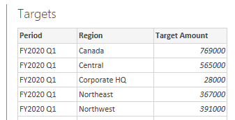
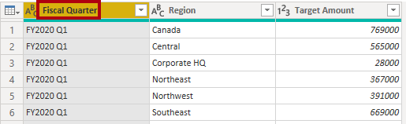
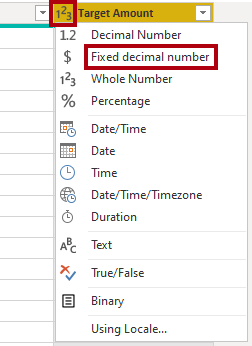
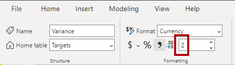
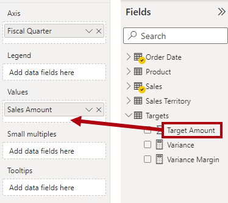

---
lab:
  title: Creación de un modelo compuesto
  module: Design and build tabular models
---

# Creación de un modelo compuesto

## Información general

**El tiempo estimado para completar el laboratorio es de 30 minutos.**

En este laboratorio crearás un modelo compuesto agregando una tabla a un modelo DirectQuery desarrollado previamente.

En este laboratorio, aprenderá a:

- Crear un modelo compuesto.

- Creación de relaciones de modelos.

- Creación de medidas.

## Introducción

En este ejercicio prepararás el entorno.

### Clonación del repositorio para este curso

1. En el menú de inicio, abre el símbolo del sistema

    

1. En la ventana del símbolo del sistema, ve a la unidad D escribiendo:

    `d:` 

   Presione Entrar.

    


1. En la ventana del símbolo del sistema, escribe el siguiente comando para descargar los archivos del curso y guardarlos en una carpeta denominada DP500.
    
    `git clone https://github.com/MicrosoftLearning/DP-500-Azure-Data-Analyst DP500`
   
1. Cuando se haya clonado el repositorio, cierra la ventana del símbolo del sistema. 
   
1. Abre la unidad D en el explorador de archivos para asegurarte de que se han descargado los archivos.

### Configurar Power BI Desktop

En esta tarea abrirás un archivo de plantilla de Power BI desarrollado previamente.

1. Para abrir Explorador de archivos, en la barra de tareas, selecciona el acceso directo **Explorador de archivos**.

2. Ve a la carpeta **D:\DP500\Allfiles\08\Starter**.

3. Para abrir un archivo de Power BI Desktop desarrollado previamente, haz doble clic en el archivo **Sales Analysis - Create a composite model.pbit** . 

4. Si se te pide que apruebes un riesgo de seguridad potencial, selecciona **Aceptar**.

5. Escribe SQLServerInstance, SqlServerDatabase y Culture como se indica después. Seleccione **Cargar**.

    SqlServerInstance = ```localhost```

    SqlServerDatabase = ```AdventureWorksDW2022-DP500```

    Culture = ```en```

    

6. En el símbolo del sistema de conexión de la base de datos de SQL Server, selecciona **Conectar**.

7. En la ventana Compatibilidad con cifrado, selecciona **Aceptar**.

8. En la ventana Consulta de base de datos nativa, selecciona **Ejecutar**.

9. Guarde el archivo. En el menú **Archivo**, selecciona **Guardar como**.

10. En la ventana **Guardar como**, ve a la carpeta **D:\DP500\Allfiles\08\MySolution**. El nombre de archivo es **Sales Analysis - Create a composite model.pbix**.

11. Seleccione **Guardar**.

### Revisar el informe

En esta tarea revisarás el informe desarrollado previamente.

1. En Power BI Desktop, en la esquina inferior derecha de la barra de estado, observa que el modo de almacenamiento es DirectQuery.

    

    *Un modelo de DirectQuery consta de tablas que usan el modo de almacenamiento de DirectQuery. Una tabla que usa el modo de almacenamiento DirectQuery pasa las consultas al origen de datos subyacente. Los modeladores de datos suelen usar este modo de almacenamiento para modelar grandes volúmenes de datos. En este caso, el origen de datos subyacente es una base de datos de SQL Server.*

1. Revisa el diseño de informe.

    

    *Esta página del informe tiene un título y dos objetos visuales. El objeto visual de segmentación permite filtrar por un solo año fiscal, mientras que el objeto visual del gráfico de columnas muestra los importes de ventas trimestrales. Mejorarás este diseño agregando destinos de ventas al objeto visual del gráfico de columnas.*

1. En la segmentación **Año fiscal**, selecciona **FY2021**.

    

    *Es importante comprender que las selecciones de segmentación cambian los filtros aplicados al objeto visual del gráfico de columnas. Power BI actualiza el objeto visual de gráfico de columnas. Esto implica recuperar datos de la base de datos de origen. De este modo, el objeto visual del gráfico de columnas muestra los datos de origen más recientes. (Es posible que se produzca algún almacenamiento en caché de nivel de informe, lo que significa que el informe puede reutilizar los datos consultados previamente).*

### Revisión del modelo de datos

En esta tarea revisarás el modelo de datos desarrollado previamente.

1. Cambia a la vista **Modelo**.

    

1. Usa el diagrama de modelos para revisar el diseño del modelo.

    

    *El modelo consta de tres tablas de dimensiones y una tabla de hechos. La tabla de hechos **Ventas** representa los detalles del pedido de venta. Es un diseño de esquema de estrella clásico. La barra en la parte superior de cada tabla indica que usa el modo de almacenamiento DirectQuery. Dado que cada tabla tiene una barra azul, indica que todas las tablas pertenecen al mismo grupo de origen.*

    *También ampliarás el modelo con otra tabla de hechos para admitir el análisis de los hechos de destino de ventas.*

## Creación de un modelo compuesto

En este ejercicio agregarás una tabla de importación que convertirá el modelo de DirectQuery en un modelo compuesto.

*Un modelo compuesto consta de más de un grupo de origen.*

### Agregar una tabla

En esta tarea agregarás una tabla que almacena los destinos de ventas procedentes de un libro de Excel.

1. En la ficha de cinta **Inicio**, en el interior del grupo **Datos**, selecciona **Libro de Excel**.

    

1. En la ventana **Abrir**, ve a la carpeta **D:\DP500\Allfiles\08\Assets**.

1. Selecciona el archivo **SalesTargets.xlsx**.

    

1. Seleccione **Open** (Abrir).

    

1. En la ventana **Navegador**, activa la tabla **Destinos**.

    

1. En el panel de vista previa (situado a la derecha), observa que la tabla consta de tres columnas y cada fila de la tabla representa un trimestre fiscal, una región de ventas y un importe de ventas objetivo.

    

    *Importarás estos datos para agregar una tabla al modelo de DirectQuery. Dado que no es posible conectarse a un libro de Excel mediante DirectQuery, Power BI lo importará.*

1. Seleccione **Transformar datos**.

    

1. En la ventana Editor de Power Query, para cambiar el nombre de la primera columna, haz doble clic en el encabezado de columna **Período**.

1. Cambia el nombre de la columna a **Trimestre fiscal** y presiona **Entrar**.

    

1. Para modificar el tipo de datos de la tercera columna, en el encabezado de columna **Cantidad de destino**, selecciona el icono de tipo de datos (123) y después selecciona **Número decimal fijo**.

    

1. Para aplicar la consulta, en la ficha de cinta **Inicio**, desde el grupo **Cerrar**, selecciona el icono **Cerrar&amp;Aplicar**.

    

1. Si aparece un mensaje sobre un riesgo de seguridad potencial, léelo y luego selecciona **Aceptar**.

    

1. En Power BI Desktop, cuando se completa el proceso de carga, en el diagrama del modelo, coloca la nueva tabla directamente debajo de la tabla **Fecha de pedido**.

    *La tabla puede estar fuera de vista. Si este es el caso, desplázate horizontalmente para mostrar la tabla.*

    

1. Observa que la tabla **Destinos** no tiene una barra azul en la parte superior.

    *La ausencia de una barra indica que la tabla pertenece al grupo de origen de importación.*

### Crear relaciones de modelos

En esta tarea crearás dos relaciones del modelo.

1. Para crear una relación, desde la tabla **Territorio de ventas**, arrastra la columna **Región** y suéltala en la columna **Región** de la tabla **Destinos**.

    

1. En la ventana **Crear relación**, observa que la lista desplegable **Cardinalidad** está establecida en **Uno a varios**.

    *La columna **Región** de la tabla **Territorio de ventas** contiene valores únicos, mientras que la columna **Región** de la tabla **Destinos** contiene valores duplicados. Esta cardinalidad uno a varios es común para las relaciones entre las tablas de dimensiones y hechos.*

1. Seleccione **Aceptar**.

    

1. En el diagrama del modelo, observa que ahora existe una relación entre las tablas **Territorio de ventas** y **Destino**.

1. Observa también que la línea de relación tiene un aspecto diferente a las otras líneas de relación.

    

    *La línea "desconectada" indica que la relación es una relación limitada. Una relación de modelo se limita cuando no hay ningún lado individual garantizado. En este caso, se debe a que la relación abarca grupos de origen. En el momento de la consulta, la evaluación de relaciones puede diferir para las relaciones limitadas. Para obtener más información, consulta [Relaciones limitadas](https://docs.microsoft.com/power-bi/transform-model/desktop-relationships-understand).*

1. Crea otra relación que una la columna **Trimestre fiscal** de la tabla **Fecha de pedido** con la columna **Trimestre fiscal** de la tabla **Destinos**.

    

1. En la ventana **Crear relación**, observa que la lista desplegable **Cardinalidad** está establecida en **Varios a varios**.

    *Dado que ambas columnas contienen valores duplicados, Power BI Desktop establece automáticamente la cardinalidad en varios a varios. Sin embargo, la dirección predeterminada del filtro cruzado es incorrecta.*

1. En la lista desplegable **Dirección de filtro cruzado** cruzado, selecciona **Single (Order Date filters Targets)**.

    

    *Es habitual que las tablas de dimensiones filtren las tablas de hechos. En este diseño de modelo, no es necesario (ni eficaz) propagar filtros de la tabla de hechos a la tabla de dimensiones.*

1. Seleccione **Aceptar**.

    

### Establecimiento de las propiedades de modelo

En esta tarea establecerás las propiedades del modelo de la nueva tabla.

1. En la tabla **Destinos**, selecciona la columna **Trimestre fiscal**.

1. Mientras presionas la tecla **Ctrl**, selecciona la columna **Región**.

1. En el panel **Propiedades**, establezca la propiedad **Está oculta** en **Sí**.

    

1. En la tabla **Destinos**, selecciona la columna **Cantidad de destino**.

1. En el panel **Propiedades**, en la sección **Formato**, establece la propiedad **Posiciones decimales** en **2**.

    

### Agregar medidas

En esta tarea agregarás dos medidas para permitir el análisis de la varianza objetivo de ventas.

1. Cambie a la vista **Informe**.

    

1. Para crear una medida, en el panel **Datos**, (situado en la parte derecha) haz clic con el botón derecho en la tabla **Destinos** y selecciona **Nueva medida**.

    

1. En la barra de fórmulas, introduce la siguiente definición de medida:

    *Sugerencia: todas las definiciones de medida están disponibles para copiar y pegar desde el archivo ***D:\DP500\Allfiles\08\Assets\Snippets.txt***.*


    ```
    Variance = SUM ( 'Sales'[Sales Amount] ) - SUM ( 'Targets'[Target Amount] )
    ```


    *La medida denominada **Varianza** resta la suma de la **Cantidad de destino** de la suma de **Importe de ventas**.*

1. En la ficha de cinta contextual **Herramientas de medición**, dentro del grupo **Formato**, introduce **2** en el cuadro de posiciones decimales.

    

1. Crea otra medida con la siguiente definición de medida.


    ```
    Variance Margin =

    DIVIDE (

    [Variance],

    SUM ( 'Targets'[Target Amount] )

    )
    ```


    *La medida denominada **Margen de varianza** usa la función [DIVIDE](https://docs.microsoft.com/dax/divide-function-dax) de DAX para dividir la medida de **Varianza** por la suma de la columna **Cantidad de destino**.*

1. En la ficha de cinta contextual **Herramientas de medida**, en el grupo **Formato**, en la lista desplegable **Formato**, selecciona **Porcentaje**.

    

1. En el panel **Datos**, dentro de la tabla **Destinos**, comprueba que hay dos medidas.

    

### Actualizar el diseño del informe

En esta tarea actualizarás el informe para usar las nuevas medidas.

1. En el informe, selecciona el objeto visual de gráfico de columnas.

1. En el panel **Datos**, arrastra el campo **Cantidad de destino** al panel **Visualizaciones**, dentro del área **Valores**, directamente debajo del campo **Importe de ventas**.

    

1. Observa que el objeto visual del gráfico de columnas muestra ahora las ventas y las cantidades de destino.

1. Arrastra las dos medidas al área **Información sobre herramientas**.

    

1. Mantén el cursor sobre cualquier columna para mostrar una información sobre herramientas y observa que muestra los valores de medida.

    

    *Ahora has completado la creación de un modelo compuesto que combina DirectQuery y tablas de importación. Puedes optimizar el modelo para mejorar el rendimiento de las consultas estableciendo tablas de dimensiones para usar el modo de almacenamiento dual y añadiendo agregaciones. Sin embargo, esas mejoras serán el objetivo de aprendizaje de otros laboratorios.*

### Finalización

En esta tarea finalizarás.

1. Guarde el archivo de Power BI Desktop.

    

1. Cierre Power BI Desktop.
