---
lab:
  title: Mejora del rendimiento con tablas híbridas
  module: Optimize enterprise-scale tabular models
---

# Mejora del rendimiento con tablas híbridas

## Información general

**El tiempo estimado para completar el laboratorio es de 45 minutos.**

En este laboratorio, configurarás la actualización incremental y habilitarás una partición de DirectQuery para entregar actualizaciones en tiempo real y mejorar el rendimiento de las consultas y las actualizaciones.

En este laboratorio, aprenderá a:

- Configurar la actualización incremental.

- Revisar las particiones de la tabla.

## Introducción

En este ejercicio prepararás el entorno.

### Clonación del repositorio para este curso

1. En el menú de inicio, abre el símbolo del sistema.

    

1. En la ventana del símbolo del sistema, ve a la unidad D escribiendo:

    `d:` 

   Presione Entrar.

    

1. En la ventana del símbolo del sistema, escribe el siguiente comando para descargar los archivos del curso y guardarlos en una carpeta denominada DP500.
    
    `git clone https://github.com/MicrosoftLearning/DP-500-Azure-Data-Analyst DP500`
   
1. Cuando se haya clonado el repositorio, abre la unidad D en el explorador de archivos para asegurarte de que se han descargado los archivos. Ventana **Cerrar el símbolo del sistema**.

### Implementación de Azure SQL Database 

En esta tarea, crearás una base de datos de Azure SQL que usarás como origen de datos para Power BI. Al ejecutar el script de instalación, se creará el servidor de base de datos de Azure SQL y se cargará la base de datos AdventureWorksDW2022.

1. Para abrir Explorador de archivos, en la barra de tareas, selecciona el acceso directo **Explorador de archivos**.

2. Ve a la carpeta **D:\DP500\Allfiles\10**.

3. Haz doble clic para abrir el script de archivo **setup2.ps1**.
    - Lee el script en el Bloc de notas si estás interesado en comprender qué recursos está configurando el script. Las líneas que comienzan por # indican lo que hace el script.
    - Cierra el script.

5. En el cuadro de búsqueda de la barra de tareas, escribe `PowerShell`.  
   
   Cuando aparezcan los resultados de la búsqueda, selecciona **Ejecutar como administrador**
    
    *Cuando se te pregunte si deseas permitir que esta aplicación haga cambios en el dispositivo, selecciona Sí.*
1. En PowerShell, escribe las siguientes 2 líneas de texto para ejecutar el script. 
    
    ` cd D:\DP500\Allfiles\10`

    Presione **ENTRAR**.

    `.\setup2.ps1`
    
    Presione **Entrar**.

    

2. Cuando se te solicite, escribe el **nombre de usuario**, la **contraseña** y el **nombre del grupo de recursos** de la cuenta de Azure. Presione **ENTRAR**. 

    

    El script tarda aproximadamente 10-15 minutos en ejecutarse.

    *Nota: Este laboratorio requiere un grupo de recursos para crear una base de datos de Azure SQL. Si vas a realizar este laboratorio en un entorno de laboratorio hospedado, es posible que tengas que iniciar sesión en [Azure Portal](portal.azure.com) para obtener el nombre del grupo de recursos. Si no tienes un grupo de recursos proporcionado en un entorno de laboratorio hospedado, [crea un grupo de recursos](https://docs.microsoft.com/azure/azure-resource-manager/management/manage-resource-groups-portal#create-resource-groups) en tu suscripción de Azure.*

3. Una vez completado el script, cierra la ventana de PowerShell.

### Configuración de la base de datos de Azure SQL

En esta tarea, configurarás la base de datos de Azure SQL para permitir conexiones desde la dirección IP de la máquina virtual (VM). Este script tardará unos 10 minutos en ejecutarse después de escribir el nombre de usuario, la contraseña y el grupo de recursos.

1. En un explorador web, vaya a [https://portal.azure.com](https://portal.azure.com/).

2. Si se te pide que realices un recorrido, selecciona **Quizás más tarde**.

    

3. Selecciona el icono de **bases de datos SQL**.

    

4. En la lista de bases de datos SQL, selecciona la base de datos **AdventureWorksDW2022-DP500**.

5. En la barra de acciones de la pestaña Información general, selecciona **Establecer firewall de servidor**.

    

6. En la pestaña Acceso público, selecciona Redes seleccionadas.

7. Selecciona **Agregar la dirección IPv4 del cliente**.

    

7. Seleccione **Guardar**.

    

8. Mantén abierta la sesión de Azure Portal en el explorador web. Deberás copiar la cadena de conexión de la base de datos en la **tarea Configurar Power BI Desktop**.

### Configuración de Power BI

#### Configuración de una cuenta de Power BI en Power BI Desktop

En esta tarea configurarás Power BI Desktop.

1. Para abrir Explorador de archivos, en la barra de tareas, selecciona el acceso directo **Explorador de archivos**.

    

1. Ve a la carpeta **D:\DP500\Allfiles\10\Starter**.

1. Para abrir un archivo de Power BI Desktop previamente desarrollado, haz doble clic en el archivo **Sales Analysis - Improve performance with hybrid tables (Análisis de ventas: mejora del rendimiento con tablas híbridas**).

1. Si aún no has iniciado sesión, en la esquina superior derecha de Power BI Desktop, selecciona **Iniciar sesión**. Usa las credenciales del laboratorio para completar el proceso de inicio de sesión.

    

    *Nota: esto te llevará probablemente al servicio Power BI para completar el proceso de inicio de sesión.*

1. Para guardar el archivo, en la cinta **Archivo**, selecciona **Guardar como**.

1. En la ventana **Guardar como**, ve a la carpeta **D:\DP500\Allfiles\10\MySolution**.

#### Configuración de la versión de prueba de Power BI Premium

En esta tarea, iniciarás sesión en el servicio Power BI e iniciarás una licencia de prueba.

*Importante: si ya has configurado Power BI en el entorno de máquina virtual, continúa con la siguiente tarea.*

1. En un explorador web, vaya a [https://powerbi.com](https://powerbi.com/).

2. Usa las credenciales del laboratorio para completar el proceso de inicio de sesión.

3. En la parte superior derecha selecciona el icono de perfil y después selecciona **Iniciar prueba**.

    

4. Cuando se te solicite, selecciona **Iniciar prueba**.

    

    *Necesitas una licencia de Power BI Premium por usuario (PPU) para completar este laboratorio. Una licencia de prueba es suficiente.*

5. Realiza las tareas restantes para completar la configuración de prueba.

    *Sugerencia: la experiencia del explorador web de Power BI se conoce como el **servicio Power BI**.*

### Creación de un área de trabajo

En esta tarea crearás un área de trabajo.

1. En el servicio Power BI, para crear un área de trabajo, en el panel **Navegación** (ubicado a la izquierda), selecciona **Áreas de trabajo** y después selecciona **Crear área de trabajo**.

    

2. En el panel **Crear un área de trabajo** (situado a la derecha), en el cuadro **Nombre del área de trabajo**, escribe un nombre para el área de trabajo.

    *El nombre debe ser único dentro del inquilino.*

    

3. Debajo del cuadro **Descripción**, expande para abrir la sección **Avanzadas**.

    

4. Establece la opción **Modo de licencia** en **Premium por usuario**.

    

    *Power BI solo admite tablas híbridas y de actualización incremental en áreas de trabajo Premium.*

5. Seleccione **Guardar**.

    

    *Una vez creado, el servicio Power BI abre el área de trabajo. Volverás a este área de trabajo más adelante en este laboratorio.*

### Configurar Power BI Desktop

En esta tarea, abrirás una solución de Power BI Desktop desarrollada previamente, establecerás la configuración y los permisos del origen de datos y luego actualizarás el modelo de datos.

1. Para abrir Explorador de archivos, en la barra de tareas, selecciona el acceso directo **Explorador de archivos**.

    

2. Ve a la carpeta **D:\DP500\Allfiles\10\Starter**.

3. Para abrir un archivo de Power BI Desktop previamente desarrollado, haz doble clic en el archivo **Sales Analysis - Improve performance with hybrid tables.pbix**.

4. Para editar el origen de datos de la base de datos, en la pestaña de cinta **Inicio**, en el grupo **Consultas**, selecciona la lista desplegable **Transformar datos** y luego selecciona **Configuración del origen de datos**.

    

5. En la ventana **Configuración de origen de datos**, selecciona **Cambiar origen**.

    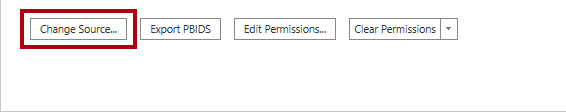

6. En la ventana **Base de datos de SQL Server**, en el cuadro **Servidor**, reemplaz el texto por el servidor de Azure SQL Database del laboratorio. Esto se encuentra en Azure Portal, bases de datos SQL.

    

7. Seleccione **Aceptar**.

    

8. Seleccione **Editar permisos**.

    

9. En la ventana **Editar permisos**, para editar las credenciales de la base de datos, selecciona **Editar**.

    

10. En la ventana **Base de datos de SQL Server**, escribe el nombre de usuario y la contraseña de la base de datos de SQL Server y guarda. 

    Nombre de usuario: `sqladmin`

    Contraseña: `P@ssw0rd01`

    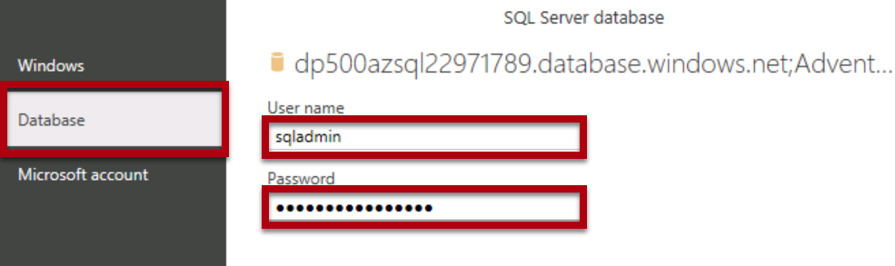

11.  Seleccione **Aceptar**.
    

12. En la ventana **Configuración del origen de datos**, selecciona **Cerrar**.

    

13. En la pestaña de cinta **Inicio**, desde el grupo **Consultas**, selecciona **Actualizar**.

    

14. Espera a que se complete el proceso de actualización.

15. Para guardar el archivo, en la ficha de cinta **Archivo**, selecciona **Guardar como**.

16. En la ventana **Guardar como**, ve a la carpeta **D:\DP500\Allfiles\10\MySolution**.

17. Seleccione **Guardar**.

18. Si aún no has iniciado sesión, en la esquina superior derecha de Power BI Desktop, selecciona **Iniciar sesión**. Usa las credenciales del laboratorio para completar el proceso de inicio de sesión.

    *Importante: Debes usar las mismas credenciales que se usaron para iniciar sesión en el servicio Power BI.*

    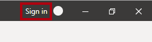

### Revisar el informe

En esta tarea revisarás el informe desarrollado previamente.

1. En Power BI Desktop, revisa el diseño del informe.

    

    *La página del informe tiene un título y dos objetos visuales. El objeto visual de segmentación permite filtrar por un solo año fiscal, mientras que el objeto visual del gráfico de barras muestra los importes mensuales de ventas. En este laboratorio, mejorarás el rendimiento del informe configurando la actualización incremental y una tabla híbrida.*

### Revisión del modelo de datos

En esta tarea revisarás el modelo de datos desarrollado previamente.

1. Cambia a la vista **Modelo**.

    

2. Usa el diagrama de modelos para revisar el diseño del modelo.

    

    *El modelo consta de cinco tablas de dimensiones y una tabla de hechos. Cada tabla usa el modo de almacenamiento de importación. La tabla de hechos **Sales** representa los detalles del pedido de venta. Es un diseño de esquema de estrella clásico.*

    *En este laboratorio, configurarás la tabla **Sales** para usar la actualización incremental y convertirse en una tabla híbrida. Una tabla híbrida incluye una partición DirectQuery que representa el período de tiempo más reciente. Esa partición garantiza que los datos actuales del origen de datos estén disponibles en los informes de Power BI.*

## Configurar la actualización incremental

En este ejercicio, configurarás la actualización incremental.

*La actualización incremental amplía las operaciones de actualización programadas al proporcionar la creación y administración automatizadas de particiones para las tablas de conjuntos de datos que suelen cargar datos nuevos y actualizados. Ayuda a reducir el tiempo de actualización, lo que reduce las cargas en los datos de origen y Power BI. También puede ayudar a exponer los datos actuales en el informe de Power BI más rápidamente.*

### Agregar parámetros

En esta tarea, agregarás dos parámetros.

1. Para abrir la ventana Editor de Power Query, en la ficha de cinta **Inicio**, dentro del grupo **Consultas**, haz clic en el icono **Transformar datos**.

    

2. En la ventana Editor de Power Query, desde el panel **Consultas**, selecciona la consulta **Sales**.

    

3. En el panel de vista previa, observa la columna **OrderDate**, que es una columna de fecha y hora.

    *La actualización incremental requiere que la tabla contenga una columna de fecha y hora o un tipo de datos entero con el valor con formato aaaammdd.*

    *Para configurar la actualización incremental, debes crear parámetros que Power BI usará para filtrar esta columna para crear particiones de tabla.*

4. Para crear un parámetro, en la pestaña de cinta **Inicio**, selecciona el icono **Parámetros del administrador**.

    

5. En la ventana **Administrar parámetros**, selecciona **Nuevo**.

    

6. En el cuadro **Nombre**, reemplaza el texto por **RangeStart**.

7. En la lista desplegable **Tipo**, selecciona **Fecha y hora**.

8. En el cuadro **Valor actual**, escribe **6/1/2022** (1 de junio de 2022: la máquina virtual usa formatos de fecha de EE. UU.). 

    *Ten en cuenta que para las ubicaciones de formato diferentes de MM-DD-AAA, la fecha debe especificarse como 1/6/2022*

    *Al configurar los parámetros, puedes usar valores arbitrarios. Power BI actualizará los valores de parámetro cuando cree y administre las particiones. En este laboratorio, establecerás un intervalo para el mes de junio de 2022.*

    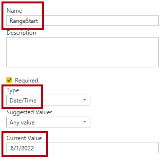

9. Selecciona **Nuevo** para crear un segundo parámetro.

10. Establece las siguientes propiedades de parámetro:

    - Nombre: **RangeEnd**

    - Tipo: **Fecha y hora**

    - Valor actual: **7/1/2022** (1 de julio de 2022)

     *Ten en cuenta que para las ubicaciones de formato distintas de MM-DD-AAA, la fecha debe especificarse como 1/7/2022.*

    

11. Seleccione **Aceptar**.

    

### Filtrar la consulta

En esta tarea, agregarás filtros a la consulta **Sales**.

1. En el panel **Consultas**, selecciona la consulta **Sales**.

2. En el encabezado de la columna **OrderDate**, selecciona la flecha abajo y después selecciona **Filtros de fecha y hora** > **Entre**.

    

3. En la ventana **Filtrar filas**, selecciona la primera lista desplegable del icono de calendario y luego selecciona **Parámetro**.

    

4. En la lista desplegable adyacente, observa que el parámetro **RangeStart** está establecido.

    *La selección de parámetros predeterminada es la correcta.*

5. En la segunda lista desplegable "rango", selecciona **antes**.

    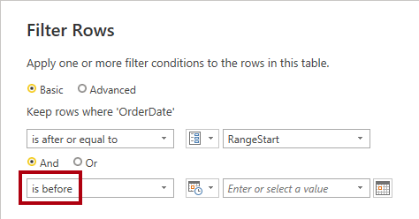

6. En las listas desplegables correspondientes, selecciona el parámetro **RangeEnd**.

    

7. Seleccione **Aceptar**.

    

8. En la ficha de cinta **Inicio**, desde el grupo **Cerrar**, haz clic en el icono **Cerrar &amp; Aplicar**.

    

9. Observa que Power BI Desktop cargó 5134 filas en la tabla **Ventas**.

    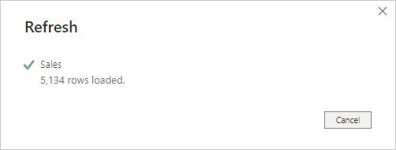

    *Estas son las filas filtradas para junio de 2022.*

10. Guarde el archivo de Power BI Desktop.

    

### Configurar la actualización incremental

En esta tarea, configurarás la directiva de actualización incremental para la tabla **Sales**.

1. En el diagrama del modelo, haz clic con el botón derecho en el encabezado de la tabla **Sales** y luego selecciona **Actualización incremental**.

    

2. En la ventana **Actualización incremental y datos en tiempo real**, en el paso 2, activa la actualización incremental.

    

3. Establece lo siguiente: Archivar los datos a partir de **2 años** antes de la fecha de actualización.

    

    *Esta configuración determina el período histórico. En este caso, Power BI creará dos particiones de año entero para los datos históricos.*

4. Establece lo siguiente: Actualizar los datos incrementalmente a partir de **7 días** antes de la fecha de actualización.

    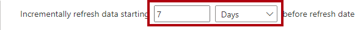

    *Esta configuración determina el período de actualización incremental en el que todas las filas con una fecha y hora en ese período se incluyen en las particiones de actualización y se actualizan con cada operación de actualización.*

5. En el paso 3, activa la opción **Obtener los datos más recientes en tiempo real con DirectQuery**.

    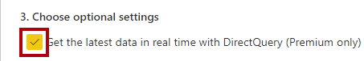

    *Esta configuración permite capturar los cambios más recientes de la tabla seleccionada en el origen de datos más allá del período de actualización incremental mediante DirectQuery. Todas las filas con una fecha y hora posteriores al período de actualización incremental se incluyen en una partición DirectQuery y se capturan del origen de datos con cada consulta de conjunto de datos. Esta configuración convierte la tabla en una tabla híbrida porque contendrá particiones de importación y una partición de DirectQuery.*

6. Seleccione **Aplicar**.

    

7. Guarde el archivo de Power BI Desktop.

    

### Publicar el conjunto de datos

En esta tarea, publicarás el conjunto de datos.

1. Para publicar el informe, en la ficha de cinta **Inicio**, selecciona **Publicar**.

    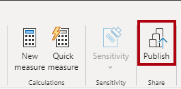

2. En la ventana **Publicar en Power BI**, selecciona el área de trabajo creada en este laboratorio y después selecciona.

    

3. Cuando la publicación se haya realizado correctamente, selecciona **Entendido**.

    

4. Cierre Power BI Desktop.

5. Si se te solicita guardar los cambios, selecciona **Guardar**.

    

### Configurar el conjunto de datos

En esta tarea, configurarás las credenciales del origen de datos y actualizarás el conjunto de datos.

1. Cambia a la sesión del explorador web del servicio Power BI.

2. En la página de aterrizaje del área de trabajo, busca el informe y el conjunto de datos.

    

3. Mantén el cursor sobre el conjunto de datos y, cuando aparezcan los puntos suspensivos, selecciona los puntos suspensivos y después selecciona **Configuración**.

    

4. En la sección **Credenciales del origen de datos**, selecciona el vínculo **Editar credenciales**.

    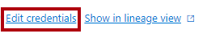

5. En la ventana, escribe el nombre de usuario y la contraseña y establece el nivel de privacidad como Organización.
       
    Nombre de usuario: `sqladmin`

    Contraseña: `P@ssw0rd01`

    

6. Seleccione **Iniciar sesión**.

    

8. Expande **Optimización de rendimiento y actualización programada**.

    

9. Observa, pero no cambies, ninguna de las opciones de configuración.

    *En una configuración real, programa la actualización de datos para permitir que Power BI actualice y administre las particiones de forma periódica.*

    *En este laboratorio, realizarás una actualización a petición.*

10. En el panel **Navegación** (ubicado a la izquierda), selecciona tu área de trabajo.

11. En la página de aterrizaje del área de trabajo, mantén el cursor sobre el conjunto de datos y después selecciona el icono **Actualizar**.

    

12. En la columna **Actualizado**, observa el icono giratorio y espera hasta que se detenga (lo que indica que se ha completado la actualización).

    

13. Para abrir la configuración del área de trabajo, en la parte superior derecha, selecciona **Configuración**.

    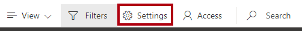

14. En el panel **Configuración**, selecciona la pestaña **Premium**.

    

15. Selecciona el icono **Copiar** para copiar la conexión del área de trabajo al portapapeles.

    

    *Usarás la conexión del área de trabajo para conectarte a ella en SQL Server Management Studio (SSMS).*

16. Para cerrar el panel, selecciona **Cancelar**.

    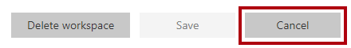

### Revisar las particiones de tabla

En esta tarea, usarás SSMS para revisar las particiones de tabla.

1. Para abrir SSMS, en la barra de tareas, selecciona el acceso directo de **SSMS**.

    

2. En la ventana **Conectar con el servidor**, en la lista desplegable **Tipo de servidor**, selecciona **Analysis Services**.

    

    *Puedes usar SSMS para conectarte al área de trabajo mediante el punto de conexión de lectura y escritura XMLA. El punto de conexión solo está disponible para las áreas de trabajo Premium.*

3. En el cuadro **Nombre del servidor**, reemplaza el texto pegando en la conexión del área de trabajo (presiona **Ctrl+V**).

4. En la lista desplegable **Autenticación**, selecciona **Azure Active Directory - Contraseña**.

5. Escribe tus credenciales del laboratorio.

6. Seleccione **Conectar**.

    

7. En Explorador de objetos (situado a la izquierda), expande la carpeta **Bases de datos**, expande para abrir la base de datos **Sales Analysis...** (conjunto de datos) y después la carpeta **Tablas**.

    

8. Haz clic con el botón derecho en la tabla **Ventas** y después selecciona **Particiones**.

    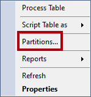

9. En la ventana **Particiones**, observa la lista de particiones del historial de dos años, seguida de particiones trimestrales y particiones diarias.

10. Desplázate hasta la parte inferior de la lista y observa que la última es una partición de DirectQuery para las fechas actuales y futuras.

    *Power BI crea y administra automáticamente todas estas particiones.*

11. Seleccione **Cancelar**.

    

## Prueba de la tabla híbrida

En este ejercicio, abrirás el informe, agregarás un pedido de ventas y después verás la actualización de datos del informe.

### Abra el informe

En esta tarea, abrirás el informe.

1. Cambia a la sesión del explorador web del servicio Power BI.

2. En la página de aterrizaje del área de trabajo, selecciona el informe.

    

3. Si es necesario, en la segmentación **Año fiscal**, selecciona el año fiscal que contiene el mes actual (en función de la fecha de hoy).

    *El mes actual debe estar visible como una barra en el gráfico de barras.*

    *Ten en cuenta que agosto de 2022 y en adelante no está en el año fiscal 2022, que es el valor predeterminado para la segmentación de datos.*

### Agregar un pedido a la base de datos

En esta tarea, agregarás un pedido a la base de datos.

1. Cambia a SSMS.

2. Para abrir un archivo de script, en el menú **Archivo**, selecciona **Abrir** > **Archivo**.

3. En la ventana **Abrir archivo**, ve a la carpeta **D:\DP500\Allfiles\10\Assets**.

4. Selecciona el archivo **1-InsertOrder.sql** y selecciona **Abrir**.

    

5. En la ventana **Conectar a motor de base de datos**, asegúrate de que la lista desplegable **Nombre del servidor** esté establecida en el servidor de Azure SQL Database del laboratorio.

6. En la lista desplegable **Autenticación**, selecciona **Autenticación de SQL Server**.

7. Escribe el nombre de usuario **sqladmin** y la contraseña.

8. Seleccione **Conectar**.

    

9. Cambia el contexto de la base de datos de `master` a `AdventureWorksDW2022-DP500` mediante el menú desplegable de la barra de herramientas de SQL Server Management Studio.

    
   
10. Revisa el script.

    *Este script inserta un único orden en la tabla **FactInternetSales** con hoy como fecha de pedido.*

11. Para ejecutar un script, en la barra de herramientas, selecciona **Ejecutar** (o presiona **F5**).

    

12. Para cerrar el archivo, en el menú **Archivo**, selecciona **Cerrar**.

### Actualizar el informe

En esta tarea, actualizarás el informe.

1. Cambia a la sesión del explorador web del servicio Power BI.

2. En el informe, toma nota del importe de ventas del mes actual.

3. En la barra de acciones, selecciona el comando **Actualizar**.

    

4. Cuando se complete la actualización del informe, comprueba que el importe de ventas del mes actual aumentó en 10 000 dólares.

    *Cuando Power BI consultó la tabla **Ventas**, recuperó los datos actuales de la partición DirectQuery, que consultaba directamente la base de datos de Azure SQL.*

    *Sugerencia: Las tablas híbridas funcionan especialmente bien con la actualización automática de páginas, que es una característica que actualiza automáticamente un informe de Power BI.*

### Finalización

En esta tarea finalizarás. Abre SSMS y asegúrate de que está conectado a la base de datos AdventureWorksDW2022-DP500.

1. En SSMS, abre el archivo **2-Cleanup.sql**.

    

    Este script elimina el pedido que insertaste.

2. Ejecute el script.

3. Cierre SSMS.
