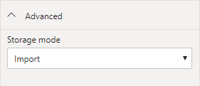
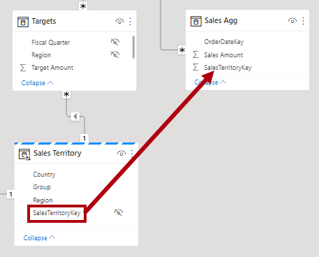
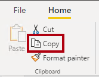

---
lab:
  title: Mejora del rendimiento de las consultas con agregaciones
  module: Optimize enterprise-scale tabular models
---

# Mejora del rendimiento de las consultas con agregaciones

## Información general

**El tiempo estimado para completar el laboratorio es de 30 minutos**

En este laboratorio añadirás una agregación para mejorar el rendimiento de las consultas de la tabla de hechos **Ventas**.

En este laboratorio, aprenderá a:

- Configuración de una agregación.

- Usa el Analizador de rendimiento para determinar si Power BI usa una agregación.

## Introducción

En este ejercicio prepararás el entorno.

### Clonación del repositorio para este curso

1. En el menú de inicio, abre el símbolo del sistema

    

1. En la ventana del símbolo del sistema, ve a la unidad D escribiendo:

    `d:` 

   Presione Entrar.

    

1. En la ventana del símbolo del sistema, escribe el siguiente comando para descargar los archivos del curso y guardarlos en una carpeta denominada DP500.
    
    `git clone https://github.com/MicrosoftLearning/DP-500-Azure-Data-Analyst DP500`
   
1. Cuando se haya clonado el repositorio, cierra la ventana del símbolo del sistema. 
   
1. Abre la unidad D en el explorador de archivos para asegurarte de que se han descargado los archivos.

### Configurar Power BI Desktop

En esta tarea abrirás una solución de Power BI Desktop desarrollada previamente.

1. Para abrir Explorador de archivos, en la barra de tareas, selecciona el acceso directo **Explorador de archivos**.

2. Ve a la carpeta **D:\DP500\Allfiles\12\Starter**.

3. Para abrir un archivo de Power BI Desktop desarrollado previamente, haz doble clic en el archivo **Sales Analysis - Improve query performance with aggregations.pbix**.

    *Si aparece una advertencia de riesgo de seguridad potencial, **selecciona Aceptar***.
    
    *Si se te pide que apruebes la ejecución de una consulta de base de datos nativa, selecciona **Ejecutar**.

4. Para guardar el archivo, en la ficha de cinta **Archivo**, selecciona **Guardar como**.

5. En la ventana **Guardar como**, ve a la carpeta **D:\P500\Allfiles\12\MySolution**.

6. Seleccione **Guardar**.

### Revisar el informe

En esta tarea revisarás el informe desarrollado previamente.

1. En Power BI Desktop, en la esquina inferior derecha de la barra de estado, observa que el modo de almacenamiento es **Mixto**.

    

    *Un modelo de modo mixto consta de tablas de diferentes grupos de origen. Este modelo tiene una tabla de importación cuyos datos tienen su origen en un libro de Excel. Las tablas restantes usan una conexión DirectQuery a una base de datos de SQL Server, que es el almacenamiento de datos.*

2. Revisa el diseño de informe.

    

    *Esta página del informe tiene un título y dos objetos visuales. El objeto visual de segmentación permite filtrar por un solo año fiscal, mientras que el objeto visual del gráfico de columnas muestra las ventas trimestrales y los importes de destino. En este laboratorio mejorarás el rendimiento del informe añadiendo una agregación.*

### Revisión del modelo de datos

En esta tarea revisarás el modelo de datos desarrollado previamente.

1. Cambia a la vista **Modelo**.

    

2. Usa el diagrama de modelos para revisar el diseño del modelo.

    

    *El modelo consta de tres tablas de dimensiones y dos tablas de hechos. La tabla de hechos **Ventas** representa los detalles del pedido de ventas, mientras que la tabla **Destinos** representa los objetivos de ventas trimestrales. Es un diseño de esquema de estrella clásico. La barra en la parte superior de algunas de las tablas indica que usan el modo de almacenamiento DirectQuery. Cada tabla que tiene una barra azul pertenece al mismo grupo de origen.*

    *Las tres tablas de dimensiones tienen una barra seccionada, que indica que usan el modo de almacenamiento dual. Esto significa que las tablas usan el modo de almacenamiento de importación y DirectQuery. Power BI determina para cada consulta el modo de almacenamiento más eficaz, esforzándose por usar el modo de importación siempre que sea posible, ya que es más rápido.*

    *En este laboratorio añadirás una agregación para mejorar el rendimiento de consultas específicas de la tabla **Ventas**.*

### Uso del analizador de rendimiento

En esta tarea abrirás el Analizador de rendimiento y lo usarás para inspeccionar los eventos de actualización.

1. Cambie a la vista **Informe**.

    

2. Para inspeccionar los eventos de actualización visual, en la ficha de cinta **Ver**, en el grupo de paneles **Mostrar**, selecciona **Analizador de rendimiento**.

    

3. En el panel **Analizador de rendimiento** (situado a la izquierda del panel **Visualizaciones**), selecciona **Iniciar grabación**.

    

    *El analizador de rendimiento inspecciona y muestra la duración necesaria para actualizar o renovar los objetos visuales. Cada objeto visual emite al menos una consulta a la base de datos de origen. Para obtener más información, consulta [Uso del Analizador de rendimiento para examinar el rendimiento de los elementos de los informes en Power BI Desktop](https://docs.microsoft.com/power-bi/create-reports/desktop-performance-analyzer).*

4. Selecciona **Actualizar objetos visuales**.

    

5. En el panel **Analizador de rendimiento**, expande el objeto visual **Sales Result by Fiscal Quarter (Resultado de ventas por trimestre fiscal)** y observa el evento de consulta directa.

6. Toma nota de la duración total en milisegundos para poder usarla como línea base para la comparación más adelante en este laboratorio.

    

    *Cada vez que veas un evento de consulta directa, indica que Power BI usó el modo de almacenamiento DirectQuery para recuperar los datos de la base de datos de origen.*

    *Una razón común por la que una tabla de hechos de almacenamiento de datos usa el modo DirectQuery se debe a sus grandes volúmenes de datos. No es posible o económicamente práctico importar un gran volumen de datos. Sin embargo, el modelo de datos puede almacenar en caché una vista agregada de la tabla de hechos que puede ayudar a mejorar el rendimiento de consultas específicas, normalmente de alto nivel.*

    *En este laboratorio añadirás una agregación de los datos de la tabla de **Ventas** para mejorar específicamente el rendimiento de las actualizaciones visuales que consultan la suma de la columna **Importe de ventas** por fecha y territorio de ventas.*

## Configuración de una agregación

En este ejercicio configurarás una agregación.

*Las agregaciones de Power BI pueden mejorar el rendimiento de las consultas en tablas DirectQuery excepcionalmente grandes. Mediante agregaciones, el modelo de datos almacena en caché los datos en un nivel agregado en memoria. Power BI usa automáticamente la agregación siempre que pueda.*

### Adición de una tabla de agregación

En esta tarea añadirás una tabla de agregación al modelo.

1. Para abrir la ventana Editor de Power Query, en la ficha de cinta **Inicio**, dentro del grupo **Consultas**, haz clic en el icono **Transformar datos**.

    

2. En la ventana Editor de Power Query, desde el panel **Consultas**, haz clic con el botón derecho en la consulta **Ventas** y después selecciona **Duplicar**.

    

3. En el panel **Consultas**, observa la adición de una nueva consulta.

    

    *Aplicarás una transformación para agrupar por las columnas **OrderDateKey** y **SalesTerritoryKey** y agregarás la suma de la columna **Importe de ventas**.*

4. En el panel **Configuración de consulta** (situado a la derecha), en el cuadro **Nombre**, reemplaza el texto por **Total de ventas**.

    

5. En la ficha de cinta **Transformar**, desde el grupo **Tabla**, selecciona **Agrupar por**.

    

6. En la ventana **Agrupar por**, selecciona la opción **Avanzadas**.

    

    *La opción avanzada permite agrupar por más de una columna.*

7. En la lista desplegable de agrupación, selecciona **OrderDateKey**.

    

8. Seleccione **Agregar agrupación**.

    

9. En la segunda lista desplegable de agrupación, selecciona **SalesTerritoryKey**.

    

10. En el cuadro **Nuevo nombre de columna**, reemplaza el texto por **Importe de ventas**.

11. En la lista desplegable **Operación**, selecciona **Suma**.

12. En la lista desplegable **Columna**, selecciona **Importe de ventas**.

    

13. Seleccione **Aceptar**.

    

14. En la ficha de cinta **Inicio**, desde el grupo **Cerrar**, haz clic en el icono **Cerrar &amp; Aplicar**.

    

    *Power BI Desktop agrega una nueva tabla al modelo.*

15. Guarde el archivo de Power BI Desktop.

    

### Establecimiento de las propiedades de modelo

En esta tarea establecerás las propiedades del modelo para la nueva tabla.

1. Cambia a la vista **Modelo**.

    

2. En el diagrama del modelo, coloca la nueva tabla para que esté a la derecha de la tabla **Destinos**.

    

3. Observa que la tabla **Total de ventas** tiene una barra azul en la parte superior, lo que indica que usa el modo de almacenamiento DirectQuery.

    *Aunque es posible que las agregaciones usen el modo de almacenamiento DirectQuery, en estos casos deben conectarse a una vista materializada en el origen de datos. En este laboratorio la agregación usará el modo de almacenamiento de importación.*

4. Selecciona la tabla **Total de ventas**.

5. En el panel **Propiedades**, expande la sección **Avanzadas**.

    

6. En la lista desplegable **Modo de almacenamiento**, selecciona **Importar**.

    

7. Cuando se te pida que confirmes la actualización, selecciona **Aceptar**.

    

    *La advertencia te informa de que Power BI Desktop podría tardar mucho tiempo en importar datos en las tablas del modelo. También te informa de que es una acción irreversible. No es posible volver a cambiar una tabla del modo de almacenamiento de importación a una tabla de modo de almacenamiento de DirectQuery (a menos que restaures desde una versión anterior del archivo de Power BI Desktop).*

8. Ten en cuenta que Power BI Desktop cargó 6806 filas de datos en la nueva tabla.

    

    *Estas filas representan cada combinación de fecha de pedido y región de ventas. Es una cantidad muy pequeña de datos que ha resumido un volumen potencialmente muy grande de filas de tabla de hechos.*

9. En la tabla **Total de ventas**, selecciona la columna **Importe de ventas**.

10. En el panel **Propiedades**, en la sección **Formato**, en la lista desplegable **Tipo de datos**, selecciona **Número decimal fijo**.

    

    *Para administrar la agregación (más adelante en este ejercicio), el tipo de datos debe coincidir con el de la columna **Importe de ventas** de la tabla **Ventas**.*

11. Cuando se te pida que confirmes la actualización, selecciona **Aceptar**.

    

### Crear relaciones de modelos

En esta tarea crearás dos relaciones del modelo.

1. Para crear una relación, desde la tabla **Fecha de pedido**, arrastra la columna **DateKey** y colócala en la columna **OrderDateKey** de la tabla **Total de ventas**.

    

2. En la ventana **Crear relación**, observa que la lista desplegable **Cardinalidad** está establecida en **Uno a varios**.

    *La columna **DateKey** de la tabla **Fecha de pedido** contiene valores únicos, mientras que la columna **OrderDateKey** de la tabla **Total de ventas** contiene valores duplicados. Esta cardinalidad uno a varios es común para las relaciones entre dimensiones y agregaciones basadas en tablas de hechos.*

3. Seleccione **Aceptar**.

    

4. En el diagrama del modelo, observa que ahora existe una relación entre las tablas **Fecha de pedido** y **Total de ventas**.

5. Crea otra relación, esta vez relativa a la columna **SalesTerritoryKey** de la tabla **Territorio de ventas** con la columna **SalesTerritoryKey** de la tabla **Total de ventas**.

    

6. En la ventana **Crear relación**, selecciona **Aceptar**.

    

    *Las tareas completadas en este laboratorio han agregado una tabla de importación al modelo y la han relacionado con otras tablas de modelos. Sin embargo, todavía no es una agregación que Power BI puede usar de forma transparente para mejorar el rendimiento de las consultas. Configurarás la agregación en la siguiente tarea.*

7. Revisa el diagrama del modelo y observa que la tabla **Total de ventas** está ahora relacionada con dos tablas de dimensiones.

    

### Configuración de una agregación

En esta tarea configurarás una agregación.

1. En el diagrama de modelos haz clic con el botón derecho en el encabezado de la tabla **Total de ventas** y después selecciona **Administrar agregaciones**.

    

2. En la ventana **Administrar agregaciones**, para la columna **OrderDateKey**, establece las siguientes propiedades:

    - Resumen: **GroupBy**

    - Tabla de detalles: **Ventas**

    - Columna de detalles: **OrderDateKey**

    

3. Para la columna **Importe de ventas**, establece las siguientes propiedades:

    - Resumen: **Suma**

    - Tabla de detalles: **Ventas**

    - Columna de detalles: **Importe de ventas**

4. Para la columna **SalesTerritoryKey**, establece las siguientes propiedades:

    - Resumen: **GroupBy**

    - Tabla de detalles: **Ventas**

    - Columna de detalles: **SalesTerritoryKey**

5. Comprueba que la configuración de agregaciones es similar a la siguiente:

    

6. Observa la advertencia que describe que Power BI ocultará la tabla.

    

    *Power BI Desktop ocultará la tabla de una manera diferente a otros objetos de modelo ocultos. Power BI siempre ocultará las agregaciones y ni siquiera los cálculos del modelo pueden hacer referencia a ellas.*

7. Selecciona **Aplicar todo**.

    

8. En el diagrama del modelo, observa que la tabla **Total de ventas** es una tabla oculta.

    

    *Ahora, cada vez que un objeto visual consulta la tabla **Ventas** para obtener la suma de la columna **Importe de ventas**, agrupando por cualquier columna de las tablas **Fecha del pedido** o **Territorio de ventas**, Power BI usará la agregación en su lugar.*

### Prueba de la agregación

En esta tarea probarás la agregación y determinarás si Power BI la usa.

1. Cambie a la vista **Informe**.

    

2. En el panel **Analizador de rendimiento**, selecciona **Actualizar objetos visuales**.

    

3. Expande el objeto visual **Sales Result by Fiscal Quarter** y observa que ya no tiene un evento de consulta directa.

4. Compara la duración con la línea base que anotaste anteriormente en este laboratorio.

    

    *¿Qué ocurre cuando los usuarios filtran el objeto visual de gráfico de columnas por otras tablas?*

5. Para clonar la segmentación de datos **Año fiscal**, selecciona primero la segmentación.

6. En la ficha de cinta **Inicio**, desde el grupo **Portapapeles**, selecciona **Copiar**.

    

7. En la ficha de cinta **Inicio**, desde el grupo **Portapapeles**, selecciona **Pegar**.

    

8. Coloca la nueva segmentación de datos directamente debajo de la segmentación original.

    

9. Selecciona la nueva segmentación de datos y luego, en el panel **Visualizaciones**, en el área **Campo**, quita el campo **Año fiscal**.

    

10. En el panel **Campos**, expande la tabla **Territorio de ventas** y después arrastra el campo **Grupo** al área **Campo**.

    

11. En la segmentación de datos **Grupo**, selecciona cualquier grupo (excepto en blanco).

    

    *¿Usa Power BI la agregación?*

    *La respuesta es sí porque la agregación agrupa por la columna **SalesTerritoryKey**. Esa columna se relaciona con la tabla **Territorio de ventas**. Por lo tanto, puedes usar cualquier columna de la tabla **Territorio de ventas** para filtrar el objeto visual del gráfico de columnas y usará la agregación.*

12. Clona la segmentación de datos **Grupo** para crear una segmentación basada en el campo **Categoría** de la tabla **Producto**.

    

    *¿Usa Power BI la agregación?*

    *La respuesta es no porque la agregación no agrupa por la columna **ProductKey** (ni por ninguna otra columna de la tabla **Producto**). En este caso, Power BI debe usar una conexión DirectQuery para actualizar el objeto visual.*

    *Ahora has mejorado el rendimiento de consultas específicas al permitir que Power BI recupere datos de la memoria caché del modelo. La conclusión clave es que las agregaciones pueden acelerar el rendimiento de las consultas de tabla de hechos, especialmente para las agrupaciones de medida y de alto nivel específicas. Además, el modo de almacenamiento dual y las agregaciones funcionan bien, lo que proporciona oportunidades para Power BI para evitar el uso de costosas conexiones de DirectQuery a los datos de origen.*

### Finalización

En esta tarea finalizarás.

1. Guarde el archivo de Power BI Desktop.

    

2. Cierre Power BI Desktop.
