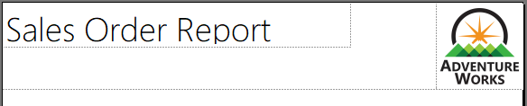
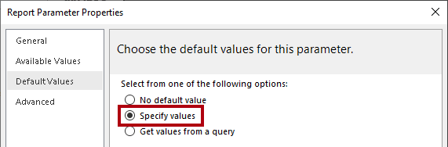
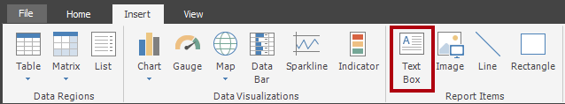
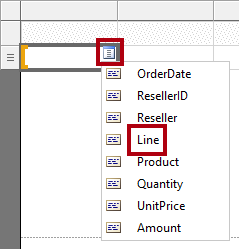
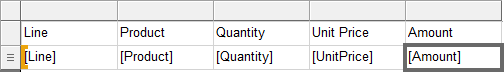
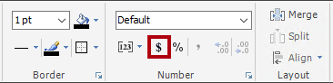
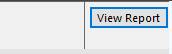

# Creación de un informe paginado

## Información general

**El tiempo estimado para completar el laboratorio es de 45 minutos.**

En este laboratorio, usarás el Generador de informes de Power BI para desarrollar un diseño de informe paginado de píxel perfecto que origina datos de la base de datos **AdventureWorksDW2022-DP500** de SQL Server. Crearás un origen de datos y un conjunto de datos, y también configurarás un parámetro de informe. El diseño del informe permitirá que los datos se representen en varias páginas y se exporten en PDF y en otros formatos.

El informe final tendrá un aspecto como el siguiente:


En este laboratorio, aprenderá a:

- Usar el Generador de informes de Power BI.

- Diseñar un diseño de informe de varias páginas.

- Definir un origen de datos.

- Definición de un conjunto de datos

- Crear un parámetro de informe.

- Exportar un informe en formato PDF.

## Introducción

En este ejercicio, abrirás el Generador de informes de Power BI para crear un informe y, después, guardarlo.

### Clonación del repositorio para este curso

1. En el menú de inicio, abre el símbolo del sistema

    

1. En la ventana del símbolo del sistema, ve a la unidad D escribiendo:

    `d:` 

   Presione Entrar.

    


1. En la ventana del símbolo del sistema, escribe el siguiente comando para descargar los archivos del curso y guardarlos en una carpeta denominada DP500.
    
    `git clone https://github.com/MicrosoftLearning/DP-500-Azure-Data-Analyst DP500`
   
1. Cuando se haya clonado el repositorio, cierra la ventana del símbolo del sistema. 
   
1. Abre la unidad D en el explorador de archivos para asegurarte de que se han descargado los archivos.

### Creación del informe

En esta tarea, abrirás el Generador de informes de Power BI para crear un informe y, después, guardarlo.

1. Para abrir el Generador de informes de Power BI, en la barra de tareas, haz clic en el acceso directo **Generador de informes de Power BI**.

    

1. Si se te pide que actualices a la versión más reciente del Generador de informes de Power BI, selecciona **Cancelar**.

2. En la ventana del Generador de informes de Power BI, para crear un informe nuevo, en la ventana **Introducción**, selecciona **Informe en blanco**.

    

  
3. Para guardar el informe, selecciona la pestaña **Archivo** (situada en la parte superior izquierda) y después selecciona **Guardar**.

    

4. En la ventana **Guardar como informe**, ve a la carpeta **D:\DP500\Allfiles\15\MySolution**.

5. En el cuadro **Nombre**, escriba **Informe de pedidos de ventas**.

6. Seleccione **Guardar**.

## Desarrollo del diseño del informe

En este ejercicio, desarrollarás el diseño del informe y explorarás su diseño final.

### Configuración del encabezado del informe

En esta tarea, configurará el encabezado del informe.

1. En el diseñador de informes, observe el diseño del informe predeterminado, que consta de un cuerpo y un pie de página.

    

    *El cuerpo contiene un solo cuadro de texto preparado para un título de informe, y el pie de página del informe contiene un solo cuadro de texto que describe el tiempo de ejecución del informe.*

    *El diseño predeterminado representará el título del informe una vez, en el cuerpo, en la primera página representada. Pero ahora modificarás el diseño del informe agregando una región de encabezado de informe y moviendo el cuadro de texto título del informe a esta región. De este modo, el título del informe se repetirá en cada página. También agregarás una imagen del logotipo de la empresa.*

2. Para agregar una región de encabezado del informe, en la pestaña **Insertar** de la cinta de opciones, desde el grupo **Encabezado &amp; Pie de página**, abre **Encabezado** y selecciona **Agregar encabezado**.

    

3. En el diseñador de informes, observe que se ha agregado una región de encabezado del informe al diseño del informe.

4. Para seleccionar el cuadro de texto del cuerpo, selecciona el cuadro de texto "Haz clic para agregar un título".

5. Para desplazar el cuadro de texto, selecciona el icono de flecha de cuatro puntas y arrástralo al encabezado para colocarlo en la parte superior izquierda de la región de encabezado del informe.

    

6. Para modificar el texto del cuadro de texto del título del informe, selecciona dentro del cuadro de texto y escribe: **Informe de pedidos de venta**

    *Para cambiar el tamaño del cuadro de texto, primero abre el panel **Propiedades**. Para un control específico de las propiedades de ubicación y tamaño, necesitarás usar el panel **Propiedades**.*

7. En la pestaña **Vista** de la cinta de opciones, en el grupo **Mostrar u ocultar**, selecciona **Propiedades**.

    

8. Para centrarte el cuadro de texto del título del informe, en primer lugar selecciona un área fuera del cuadro de texto y, después, vuelve a seleccionar el cuadro de texto.

    *El cuadro de texto está seleccionado cuando se ve el borde del cuadro de texto resaltado y los controladores de cambio de tamaño (círculos pequeños) aparecen en el borde.*

9. En el panel **Propiedades**, que se encuentra a la derecha, desplácese hacia abajo en la lista para buscar el grupo **Posición**.

    

    *El grupo **Posición** permite establecer los valores exactos de la ubicación y el tamaño de los elementos de informe.*

    *Importante: Escribe los valores según las instrucciones de este laboratorio. Se requiere un diseño de píxel perfecto para lograr la representación de la página al final del laboratorio.*

10. En el grupo **Posición**, expanda el grupo **Ubicación** y asegúrese de que las propiedades **Izquierda** y **Superior** estén establecidas en **0in**.

    *Las unidades de tamaño y ubicación están en pulgadas porque la configuración regional de la máquina virtual del laboratorio está establecida en Estados Unidos. Si tu región usa el sistema métrico decimal, la unidad predeterminada sería centímetros.*

11. En el grupo **Posición**, expanda el grupo **Tamaño** y, después, establezca la propiedad **Ancho** en **4**.

    


12. Para insertar una imagen, en la pestaña **Insertar** de la cinta de opciones, desde el grupo **Elementos de informe**, selecciona **Imagen**.

    

13. Para agregar la imagen al diseño del informe, selecciona el área dentro de la región de encabezado del informe, a la derecha del cuadro de texto del título del informe.

14. En la ventana **Propiedades de la imagen**, para realizar la importación desde un archivo de imagen, selecciona **Importar**.

    

15. En la ventana **Abrir**, ve a la carpeta **D:\DP500\Allfiles\15\Assets** y, después, selecciona el archivo **AdventureWorksLogo.jpg**.

16. Seleccione **Open** (Abrir).

17. En la ventana **Propiedades de la imagen**, selecciona **Aceptar**.

18. En el diseñador de informes, fíjate en que se ha agregado la imagen y está centrada.

 

19. Para colocar y cambiar el tamaño de la imagen, en el panel **Propiedades**, configure las propiedades siguientes:

    |  **Propiedad** | **Valor** |
    |--- | --- |
    |  Posición > Ubicación > Izquierda| 5 |
    |  Posición > Ubicación > Superior| 0 |
    |  Posición > Tamaño > Ancho| 1 |
    |  Posición > Tamaño > Alto| 1 |


20. Para cambiar el tamaño de la región del encabezado del informe, en primer lugar selecciona la región seleccionando un área en blanco de la región.

21. En el panel **Propiedades**, establece la propiedad **General** > **Alto** en **1**.

22. Compruebe que la región del encabezado del informe contiene un solo cuadro de texto e imagen y que tiene un aspecto similar al siguiente:

    

23. Para guardar el informe, en la pestaña **Archivo**, selecciona **Guardar**.

    *Sugerencia: También puedes seleccionar el icono del disco que se encuentra en la parte superior izquierda.*

    

    *Ahora estás a punto para configurar el informe a fin de recuperar el resultado de una consulta de base de datos.*


### Recuperación de datos

En esta tarea, crearás un origen de datos y un conjunto de datos para recuperar el resultado de una consulta de la base de datos **AdventureWorksDW2022-DP500** de SQL Server.

1. En el panel **Datos de informe**, situado a la izquierda, haga clic con el botón derecho en la carpeta **Orígenes de datos** y, después, seleccione **Agregar origen de datos**.

    

    *Es posible recuperar datos desde bases de datos locales o en la nube, o un conjunto de datos de Power BI.*

2. En la ventana **Propiedades del origen de datos**, en el cuadro **Nombre** reemplaza el texto por **AdventureWorksDW2022**.

3. En la lista desplegable **Seleccionar tipo de conexión**, observe que se ha seleccionado **Microsoft SQL Server**.

4. Para compilar la cadena de conexión, selecciona **Compilar**.

    


5. En la ventana **Propiedades de conexión**, en el cuadro **Nombre del servidor**, escriba **localhost**.

    *En este laboratorio, te conectarás a la base de datos de SQL Server mediante **localhost**. Pero este no es un procedimiento recomendado al crear tus propias soluciones porque los orígenes de datos de puerta de enlace no pueden resolver **localhost**.*

6. En la lista desplegable **Seleccione o escriba un nombre de base de datos**, selecciona la base de datos **AdventureWorksDW2022-DP500**.

7. Seleccione **Aceptar**.

8. En la ventana **Propiedades del origen de datos**, selecciona **Aceptar**.

9. En el panel **Datos de informe**, observa la incorporación del origen de datos **AdventureWorksDW2022**.

    

10. Para crear un conjunto de datos, en el panel **Datos de informe**, haz clic con el botón derecho en el origen de datos **AdventureWorksDW2020** y, después, selecciona **Agregar conjunto de datos**.

    

    *Un conjunto de datos de un informe tiene una estructura y un propósito distintos a los de uno de Power BI.*

11. En la ventana **Propiedades del conjunto de datos**, en el cuadro **Nombre** reemplace el texto por **SalesOrder**.


12. Para importar una consulta predefinida, selecciona **Importar**.

    

13. En la ventana **Importar consulta**, ve hasta la carpeta **D:\DP500\Allfiles\15\Assets** y, después, selecciona el archivo **SalesOrder.sql**.

14. Seleccione **Open** (Abrir).

15. En el cuadro **Consulta**, revise la consulta y asegúrese de desplazarse hacia abajo hasta la parte inferior del texto de la consulta.

    *No es importante que comprendas los detalles de la instrucción de consulta. Se ha diseñado para recuperar los detalles de la línea de pedidos de ventas. La cláusula WHERE incluye un predicado para restringir el resultado de la consulta a un único pedido de ventas. La cláusula ORDER BY garantiza que las filas se devuelven por orden de número de línea.*

16. Fíjate en el uso de **@SalesOrderNumber** en la cláusula WHERE, que representa un parámetro de consulta.

    

    *Un parámetro de consulta es un marcador de posición para un valor que se pasará en tiempo de ejecución de la consulta. Configurarás un parámetro de informe para solicitar al usuario del informe un único número de pedido de ventas que, a continuación, se pasará al parámetro de consulta.*

17. Seleccione **Aceptar**.


18. En el panel **Datos de informe**, observe la incorporación del conjunto de datos **SalesOrder** y sus campos.

    

    *Los campos se usan para configurar regiones de datos en el diseño del informe. Se derivaron de las columnas de consulta del conjunto de datos.*

19. Guarde el informe.

### Configuración del parámetro de informe

En esta tarea, configurará el parámetro de informe con un valor predeterminado.

1. En el panel **Datos de informe**, expande la carpeta **Parámetros** para mostrar el parámetro de informe **SalesOrderNumber**.

    

    *El parámetro de informe **SalesOrderNumber** se agregó automáticamente cuando se creó el conjunto de datos. Se debe a que la consulta del conjunto de datos incluía el parámetro de consulta **@SalesOrderNumber**.*

2. Para editar el parámetro de informe, haga clic con el botón derecho en el parámetro de informe **SalesOrderNumber** y, después, seleccione **Propiedades de parámetro**.

    

3. En la ventana **Propiedades de parámetro de informe**, a la izquierda, seleccione las páginas **Valores predeterminados**.

    

4. Seleccione la opción **Especificar valores**.

    

5. Para agregar un valor predeterminado, selecciona **Agregar**.


6. En la lista desplegable **Valor**, reemplace el texto por **43659**.

    

    *El pedido de ventas 43659 es el valor que usarás inicialmente para probar el diseño del informe.*

7. Seleccione **Aceptar**.

8. Guarde el informe.

    *Ahora completarás el diseño de la región de encabezado del informe mediante la incorporación de cuadros de texto para describir el pedido de ventas.*

### Finalización del diseño de encabezado del informe

En esta tarea, finalizará el diseño de la región de encabezado del informe con la incorporación de cuadros de texto.

1. Para agregar un cuadro de texto a la región de encabezado del informe, en la pestaña **Insertar** de la cinta de opciones, desde el grupo **Elementos de informe**, selecciona **Cuadro de texto**.

    

2. Selecciona la región del encabezado del informe, directamente debajo del cuadro de texto del título del informe.

3. En el nuevo cuadro de texto, escribe **Pedido de ventas:** seguido de un espacio.

4. Para insertar un marcador de posición, justo después del espacio que acaba de escribir, haga clic con el botón derecho y, después, seleccione **Crear marcador de posición**.

    


5. En la ventana **Propiedades del marcador de posición**, a la derecha de la lista desplegable **Valor**, selecciona el botón **fx**.

    

    *El botón **fx** permite escribir una expresión personalizada. Esta expresión se usará para devolver el número de pedido de venta.*

6. En la ventana **Expresión**, en la lista **Categoría**, seleccione **Parámetros**.

    

7. En la lista **Valores**, haga doble clic en el parámetro **SalesOrderNumber**.

8. En el cuadro expresión, observe que se ha agregado una referencia mediante programación al parámetro de informe **SalesOrderNumber**.

    

9. Seleccione **Aceptar**.

10. En la ventana **Propiedades del marcador de posición**, selecciona **Aceptar**.

11. Selecciona un área en blanco de la región del encabezado del informe y después selecciona el cuadro de texto nuevo.

12. En el panel **Propiedades**, configure las propiedades de posición siguientes:

    |  **Propiedad**| **Valor** |
    | --- | --- |
    |  Posición > Ubicación > Izquierda| 0 |
    |  Posición > Ubicación > Superior| 0.5 |
    |  Posición > Tamaño > Ancho| 4 |
    |  Posición > Tamaño > Alto| 0,25 |


13. Para dar formato a parte del texto del cuadro de texto, seleccione solo el texto **Pedido de ventas:** en el cuadro de texto nuevo.

    

14. En la pestaña **Inicio** de la cinta de opciones, desde el grupo **Fuente**, selecciona el comando **Negrita**.

    

15. Agregue otro cuadro de texto a la región del encabezado del informe y, después, escriba el texto **Revendedor:** seguido de un espacio.

    *Sugerencia: También puedes agregar un cuadro de texto haciendo clic con el botón derecho en el lienzo y seleccionando **Insertar** > **Cuadro de texto**.*

16. Después del espacio, inserte un marcador de posición y, luego, establezca el valor del marcador de posición para utilizar una expresión.


17. En la ventana **Expresión**, en la lista **Categoría**, seleccione **Conjuntos de datos**.

    

18. Base el valor de la expresión en el valor **First(Reseller)**.

19. En el panel **Propiedades**, configure las propiedades de posición siguientes:

    |  **Propiedad**| **Valor** |
    | --- | --- |
    |  Posición > Ubicación > Izquierda| 0 |
    |  Posición > Ubicación > Superior| 0,75 |
    |  Posición > Tamaño > Ancho| 4 |
    |  Posición > Tamaño > Alto| 0,25 |


20. Aplica formato al texto **Revendedor:** en negrita.

21. Agregue un tercer y último cuadro de texto a la región del encabezado del informe y, después, escriba el texto **Fecha del pedido:** seguido de un espacio.

22. Después del espacio, inserte un marcador de posición y establezca el valor de este para que use una expresión basada en la categoría **Conjuntos de datos**, valor **First(OrderDate)**.

    


23. Para dar formato al valor de fecha, en la ventana **Propiedades del marcador de posición**, seleccione la página **Número**.

    

24. En la lista **Categoría**, seleccione **Fecha**.

    

25. Seleccione un tipo de formato de fecha adecuado en la lista **Tipo**.

26. En la ventana **Propiedades del marcador de posición**, selecciona **Aceptar**.

27. En el panel **Propiedades**, configure las propiedades de posición siguientes:

    |  **Propiedad**| **Valor** |
    | --- | --- |
    |  Posición > Ubicación > Izquierda| 0 |
    |  Posición > Ubicación > Superior| 1 |
    |  Posición > Tamaño > Ancho| 4 |
    |  Posición > Tamaño > Alto| 0,25 |


28. Aplica formato al texto **Fecha del pedido:** en negrita.

29. Por último, selecciona un área en blanco de la región de encabezado del informe.

30. En el panel **Propiedades**, establezca la propiedad **Alto** en **1,5**.


31. Compruebe que la región del encabezado del informe tenga el aspecto siguiente:

    

32. Guarde el informe.

33. Para obtener una vista previa del informe, en la pestaña **Inicio** de la cinta de opciones, dentro del grupo **Vistas**, selecciona **Ejecutar**.

    

    *La ejecución del informe representa el informe en formato HTML. Puesto que el único parámetro de informe tiene un valor predeterminado, el informe se ejecuta de forma automática.*

34. Compruebe que el informe representado tiene un aspecto similar al siguiente:

    


35. Para volver a la vista Diseño, en la pestaña **Ejecutar** de la cinta de opciones, desde el grupo **Vistas**, selecciona **Diseño**.

    

    *Ahora agregarás una tabla al cuerpo del informe para mostrar un diseño con formato de las líneas del pedido de ventas.*

### Incorporación de una región de datos de tabla

En esta tarea, se agregará una región de datos de tabla al cuerpo del informe.

1. En la pestaña **Insertar** de la cinta de opciones, desde el grupo **Regiones de datos**, abre **Tabla** y luego selecciona **Insertar tabla**.

    

2. Para agregar la tabla, selecciona un área en blanco en el cuerpo del informe.

3. En el panel **Propiedades**, configure las propiedades de posición siguientes:

    |  **Propiedad**| **Valor** |
    | --- | --- |
    |  Posición > Ubicación > Izquierda| 0 |
    |  Posición > Ubicación > Superior| 0 |


    *La tabla mostrará cinco columnas. De forma predeterminada, la plantilla de tabla solo incluye tres columnas.*


4. Para agregar una columna a la tabla, haz clic con el botón derecho en cualquier celda de la última columna y selecciona **Insertar columna** > **Derecha**.

    

5. Repita el último paso para agregar una segunda columna nueva.

6. Mantenga el cursor sobre la celda de la segunda fila de la primera columna para mostrar el icono del selector de campos.

    

7. Selecciona el icono del selector de campos y luego selecciona el campo **Línea**.

    

8. Observe que la tabla incluye ahora un valor de texto en la primera fila (encabezado) y una referencia de campo en la fila de detalles.

    

9. Agregue campos a las cuatro columnas siguientes, en orden, tal como se indica a continuación:

    - Producto

    - Quantity

    - UnitPrice

    - Amount

10. Compruebe que el diseño de la tabla tiene un aspecto similar al siguiente:

    

11. Guarde el informe.

12. Obtenga una vista previa del informe.

    

    

    *La tabla incluye un encabezado y 12 filas de línea de pedido de ventas. Hay muchas mejoras que se pueden realizar mediante el formato del diseño de la tabla.*

    *En la siguiente tarea, deberás hacer lo siguiente:*

    - *Dar formato al encabezado de la tabla mediante un color de fondo y un estilo de fuente en negrita*

    - *Modificar el ancho de las columnas para quitar el espacio redundante y evitar que se ajusten los valores de texto largo*

    - *Justificar a la izquierda los valores de la primera columna*

    - *Justificar a la derecha los valores de las tres últimas columnas*

    - *Dar formato a los valores de moneda mediante un símbolo de moneda (para USD)*

    - *Agregar una fila de totales de la tabla y darle formato*


### Aplicación de formato a la región de datos de la tabla

En esta tarea, dará formato a la región de datos de la tabla.

1. Vuelva a la vista Diseño.

2. Selecciona cualquier celda de la tabla para mostrar las guías de celda gris (ubicadas en la parte superior y en el lado izquierdo de la región de datos).

    

    *Las guías de celda están ahí para ayudarte a configurar filas o columnas completas.*

3. Para dar formato al encabezado de la tabla, selecciona la guía de fila del encabezado.

    

    *Al seleccionar una fila o una guía de columnas, se seleccionan todas las celdas de la fila o columna. Cada celda es de hecho un cuadro de texto. Después, se puede aplicar formato a un cuadro de texto único o a una selección múltiple de cuadros de texto mediante el panel **Propiedades** o los comandos de la cinta de opciones.*

4. En el panel (o cinta de opciones) **Propiedades**, configure las propiedades siguientes:

    |  **Propiedad**| **Valor** |
    | --- | --- |
    |  Relleno > BackgroundColor| DarkGreen (Sugerencia: Desplace el cursor sobre cada color para mostrar su nombre). |
    |  Fuente > Color| Blanco |
    |  Fuente > Fuente > FontWeight| Negrita |


5. Seleccione la primera guía de columna.

    

6. En el panel **Propiedades**, establece la propiedad **Posición** > **Tamaño** > **Ancho** en **0,5**.

7. Establezca el ancho de la segunda columna en **2,5**.

8. Selecciona la guía de columna **Quantity** y luego, mientras presionas la tecla **Ctrl**, selecciona también las dos últimas guías de encabezado de columna (**Unit Price** y **Amount**).

9. En el panel (o cinta de opciones) **Propiedades**, establece la propiedad **Alineación** > **TextAlign** en **Derecha**.

10. Establezca el cuadro de texto de detalle de **Línea** como alineación a la izquierda.

    

11. En la pestaña **Inicio** de la cinta de opciones, desde el grupo **Número**, establezca los dos últimos cuadros de texto (no el encabezado) de detalle (**UnitPrice** y **Amount**) para aplicar formato con un símbolo de moneda.

    

    


12. Para agregar una fila de totales a la tabla, haga clic con el botón derecho en el cuadro de texto de detalle de **Quantity** y, después, seleccione **Agregar total**.

    

13. Observe que se ha agregado una fila nueva, que representa el pie de página de la tabla, y que la expresión evaluará la suma de los valores **Quantity**.

14. Repita el último paso para agregar un total para el cuadro de texto de detalle de **Amount**.

15. En la primera celda de la fila del pie de página de la tabla, escriba la palabra **Total**.

16. Aplique formato de negrita a todos los cuadros de texto de la fila del pie de página.

17. Compruebe que el diseño de la tabla tiene un aspecto similar al siguiente:

    


18. Para quitar el espacio final después de la tabla, mantenga el cursor sobre la línea discontinua entre el cuerpo del informe y la región del pie de página del informe y, después, arrastre hacia arriba para tocar la parte inferior de la tabla.

    

19. Guardar el informe

20. Obtenga una vista previa del informe.

21. Compruebe que el informe representado tiene un aspecto similar al siguiente:

    

22. En el cuadro del parámetro **Número del pedido de ventas**, reemplace el valor por **51721**.

    

23. Para volver a ejecutar el informe, en la derecha, selecciona **Ver informe**.

    

    *Este pedido de ventas tiene 72 líneas de pedido de ventas, por lo que los datos se representarán en muchas páginas.*

24. Para ir a la segunda página del informe, en la pestaña **Ejecutar** de la cinta de opciones, desde el grupo **Navegación**, selecciona **Siguiente**.

    

25. En la página 2, observe que el encabezado de la tabla no aparece.

    *Este tema se abordará en la tarea siguiente.*

26. Desplácese hasta la parte inferior de la página y, después, observe que el pie de página del informe muestra solo la hora de ejecución.

    *En la tarea siguiente, se mejorará el texto del pie de página con la anexión del número de página.*

### Finalización del diseño del informe

En esta tarea, finalizará el diseño del informe asegurándose de que los informes de varias páginas se representan correctamente.

1. Cambie a la vista Diseño.

2. Para asegurarse de que el encabezado de la tabla se repite en todas las páginas, seleccione primero cualquier cuadro de texto de esta tabla.

3. En el panel **Agrupación** (situado en la parte inferior del diseñador de informes), en el extremo derecho de **Grupos de columnas**, selecciona la flecha hacia abajo y luego selecciona **Modo avanzado**.

    

4. En la sección **Grupos de filas**, seleccione el primer grupo estático.

    

    *Esto ha seleccionado la fila de encabezado de la tabla.*

5. En el panel **Propiedades**, establece la propiedad **Otro** > **RepeatOnNewPage** en **True**.

    *Esto garantiza que el primer grupo estático (que representa el encabezado de tabla) se repite en todas las páginas.*

6. En la región del pie de página de la tabla, haga clic con el botón derecho en el cuadro de texto **ExecutionTime** y, después, seleccione **Expresión**.

    

7. En la ventana **Expresión**, en el cuadro expresión, anexa un espacio, seguido de **&amp; " | Page " &amp;** para generar la siguiente expresión:


    ```
    =Globals!ExecutionTime & " | Page " &
    ```


8. Asegúrese de que haya un espacio después del símbolo de "y" comercial (&).

9. En la lista **Categoría**, seleccione **Campos integrados**.

    

10. Para insertar el valor de número de página en la expresión, en la lista **Elemento**, haga doble clic en **PageNumber**.

11. Compruebe que la expresión completa es la siguiente:

    

12. Seleccione **Aceptar**.

13. Arrastre el lado izquierdo del cuadro de texto para aumentar el ancho hasta que sea del mismo tamaño que el de la página del informe.

    

    *Ahora se ha completado el diseño del informe. Por último, asegúrate de que el ancho de página se establece en exactamente seis pulgadas y quita también el valor predeterminado del parámetro de informe.*

14. Para seleccionar el cuerpo del informe, haz clic con el botón derecho en cualquier cuadro de texto de la tabla y selecciona **Seleccionar** > **Cuerpo**.

    

    *A medida que la tabla rellena todo el cuerpo del informe, se debe usar esta técnica para seleccionarlo.*

15. En el panel **Propiedades**, comprueba que la propiedad **Posición** > **Tamaño** > **Ancho** está establecida en **6**.

    *Es importante que el ancho no sea superior a seis pulgadas, ya que la representación en formato de impresión dividiría la tabla en varias páginas.*

16. En el panel **Datos de informe**, abre las propiedades de parámetro de informe **SalesOrderNumber**.

17. En la página **Valores predeterminados**, seleccione la opción **Ningún valor predeterminado**.

    

18. Seleccione **Aceptar**.

19. Guarde el informe.

  

### Exploración del informe completado

En esta tarea, verá el informe en el modo de diseño de impresión.

1. Obtenga una vista previa del informe.

2. En el cuadro del parámetro **Número del pedido de ventas**, escriba el valor **51721**.

3. En la pestaña **Ejecutar** de la cinta de opciones, desde el grupo **Imprimir**, selecciona **Diseño de impresión**.

    

    *El modo de diseño de impresión proporciona una vista previa del aspecto que tendrá el informe cuando se imprima al tamaño de página estricto.*

4. Navegue a las páginas 2 y 3.

    *En este laboratorio, no publicarás el informe. Ten en cuenta que los informes paginados solo se pueden representar en el servicio Power BI cuando se almacenan en un área de trabajo que tiene el modo de licencia establecido en **Premium por usuario** o **Premium por capacidad**, y cuando esa capacidad tiene habilitada la carga de trabajo de informes paginados.*
