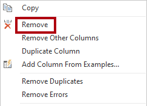
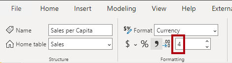

---
lab:
  title: "Creación de recursos reutilizables de Power\_BI"
  module: Manage the analytics development lifecycle
---

# Creación de recursos reutilizables de Power BI

## Información general

**El tiempo estimado para completar el laboratorio es de 45 minutos.**

En este laboratorio, crearás un conjunto de datos de Power BI especializado que extiende un conjunto de datos principal. El conjunto de datos especializado permitirá el análisis de ventas de EE. UU. per cápita.

En este laboratorio, aprenderá a:

- Crear una conexión dinámica.

- Crear un modelo de DirectQuery local.

- Usar la vista de linaje para detectar recursos de Power BI dependientes.

## Introducción

En este ejercicio prepararás el entorno.

### Clonación del repositorio para este curso

1. En el menú de inicio, abre el símbolo del sistema

    

1. En la ventana del símbolo del sistema, ve a la unidad D escribiendo:

    `d:` 

   Presione Entrar.

    


1. En la ventana del símbolo del sistema, escribe el siguiente comando para descargar los archivos del curso y guardarlos en una carpeta denominada DP500.
    
    `git clone https://github.com/MicrosoftLearning/DP-500-Azure-Data-Analyst DP500`
   
1. Cuando se haya clonado el repositorio, cierra la ventana del símbolo del sistema. 
   
1. Abre la unidad D en el explorador de archivos para asegurarte de que se han descargado los archivos.

### Configuración de Power BI

En esta tarea, establecerás las opciones de Power BI.

1. Para abrir Power BI Desktop, en la barra de tareas, selecciona el acceso directo de **Power BI Desktop**.

2. Cierra la ventana de introducción.

3. En la esquina superior derecha de Power BI Desktop, si aún no has iniciado sesión, selecciona **Iniciar sesión**. Usa las credenciales del laboratorio para completar el proceso de inicio de sesión.

    
4. Se te redirigirá a la página de registro de Power BI en Microsoft Edge. Selecciona **Continuar** para completar el registro.

    

5. Escribe un número de teléfono de 10 dígitos y selecciona **Comenzar**. Selecciona **Comenzar** una vez más. Se te redirige a Power BI.

6. En la parte superior derecha selecciona el icono de perfil y después selecciona **Iniciar prueba**.

    

7. Cuando se te solicite, selecciona **Iniciar prueba**.


8. Realiza las tareas restantes para completar la configuración de prueba.

    *Sugerencia: la experiencia del explorador web de Power BI se conoce como el **servicio Power BI**.*

### Crear un espacio de trabajo en Power BI Service

En esta tarea crearás un área de trabajo.

1. En el servicio Power BI, para crear un área de trabajo, en el panel **Navegación** (ubicado a la izquierda), selecciona **Áreas de trabajo** y después selecciona **Crear área de trabajo**.

    


2. En el panel **Crear un área de trabajo** (situado a la derecha), en el cuadro **Nombre del área de trabajo**, escribe un nombre para el área de trabajo.

    *El nombre debe ser único dentro del inquilino.*

    

3. Seleccione **Guardar**.

    

    *Una vez creado, se abre el área de trabajo. En la tarea siguiente, publicarás un conjunto de datos en este área de trabajo.*

### Abrir el archivo de inicio en Power BI Desktop

1. Para abrir Explorador de archivos, en la barra de tareas, selecciona el acceso directo **Explorador de archivos**.

2. Desplázate a la carpeta **D:\DP500\Allfiles\16\Starter**.

3. Para abrir un archivo de Power BI Desktop previamente desarrollado, haz doble clic en el archivo **Sales Analysis - Sales Analysis - Create reusable Power BI artifacts.pbi**.

4. Si aún no has iniciado sesión, en la esquina superior derecha de Power BI Desktop, selecciona **Iniciar sesión**. Usa las credenciales del laboratorio para completar el proceso de inicio de sesión.

    

### Revisión del modelo de datos

En esta tarea revisarás el modelo de datos.

1. En Power BI Desktop, en la parte izquierda, cambia a la vista **Modelo**.

    

2. Usa el diagrama de modelos para revisar el diseño del modelo.

    

    *El modelo consta de seis tablas de dimensiones y una tabla de hechos. La tabla de hechos **Ventas** almacena los detalles del pedido de venta. Es un diseño de esquema de estrella clásico.*

### Publicación del modelo de datos

En esta tarea, publicarás el modelo de datos.

1. Para publicar el informe, en la ficha de cinta **Inicio**, selecciona **Publicar**. 

    *Si se te solicita guardar los cambios, selecciona **Guardar.***

    

2. En la ventana **Publicar en Power BI**, selecciona el área de trabajo (no el área de trabajo personal) y después selecciona **Seleccionar**.

3. Cuando la publicación se haya realizado correctamente, selecciona **Entendido**.

    *Una vez publicado, el modelo se convierte en un conjunto de datos de Power BI. En este laboratorio, este conjunto de datos es un conjunto de datos básico que un analista de negocios puede ampliar para crear un conjunto de datos especializado. En el ejercicio siguiente, crearás un conjunto de datos especializado para resolver un requisito empresarial específico.*

4. Cierre Power BI Desktop.

5. Si se te solicita guardar los cambios, selecciona **No guardar**.

## Creación de un conjunto de datos especializado

En este ejercicio, crearás un conjunto de datos especializado para permitir el análisis de ventas de EE. UU. per cápita. Dado que el conjunto de datos principal no contiene valores de rellenado, agregarás una nueva tabla para ampliar el modelo.

### Creación de una conexión dinámica

En esta tarea, crearás un nuevo informe que usa una conexión dinámica con el conjunto de datos **Sales Analysis - Create reusable Power BI artifacts**, que publicaste en el ejercicio anterior.

1. Para abrir Power BI Desktop, en la barra de tareas, selecciona el acceso directo de **Power BI Desktop**.

2. Cierra la ventana de introducción.

3. Para guardar el archivo, en la cinta **Archivo**, selecciona **Guardar como**.

4. En la ventana **Guardar como**, desplázate a la carpeta **D:\DP500\Allfiles\16\MySolution**.

5. En el cuadro **Nombre de archivo**, escribe **US Sales Analysis** (Análisis de ventas de EE. UU.).

    

6. Seleccione **Guardar**.

7. Para crear una conexión dinámica, en la ficha de cinta **Inicio**, desde el grupo **Datos**, selecciona **Conjuntos de datos de Power BI**.

    

8. En la ventana **Centro de datos**, selecciona el conjunto de datos **Sales Analysis - Create reusable Power BI artifacts**.

    

9. Seleccione **Conectar**.

10. En el cuadro de diálogo **Conectar los datos**, activa la casilla situada junto a **Sales Analysis - Create reusable Power BI artifacts** y después selecciona **Enviar** para conectarte al origen de datos.

11. Cuando se te indique la existencia de un posible riesgo de seguridad, lee la notificación y después selecciona **Aceptar**.

12. En la parte inferior izquierda, en la barra de estado, observa que el informe se conecta dinámicamente al conjunto de datos.

    

13. Cambia a la vista **Modelo**.

    

14. Si es necesario, para ajustar el diagrama de modelos a la pantalla, en la parte inferior derecha, selecciona **Ajustar a pantalla**.

    

15. Mantén el cursor sobre cualquier encabezado de tabla para mostrar una información sobre herramientas y observa que el tipo de origen de datos es SQL Server Analysis Services, el servidor hace referencia al área de trabajo y la base de datos es el conjunto de datos.

    

    *Estas propiedades indican que un modelo remoto hospeda la tabla. En la siguiente tarea, realizarás cambios en el modelo para ampliarlo. Ese proceso creará un modelo de DirectQuery local que puedes modificar de muchas maneras diferentes.*

16. Guarde el archivo de Power BI Desktop.

    

### Crear un modelo de DirectQuery local

En esta tarea, crearás un modelo de DirectQuery local.

1. En la ficha de cinta **Inicio**, en el grupo **Modelado**, selecciona **Realizar cambios en este modelo**.

    

    *Nota: si no ves la opción de realizar cambios en este modelo, debes habilitar la característica de versión preliminar, DirectQuery para conjuntos de datos PBI y AS*
    - Desplázate a **Archivo** > **Opciones y configuración** > **Opciones** y, en la sección Características en vista previa, activa la casilla DirectQuery para conjuntos de datos de Power BI y Analysis Services a fin de habilitar esta característica en vista previa. Para que el cambio se aplique, puede que tenga que reiniciar Power BI Desktop. 

2. Cuando se te solicite, lee el mensaje de la ventana de diálogo y selecciona **Agregar un modelo local**.

    

    *El modelo ahora es un modelo de DirectQuery. Ahora es posible mejorar el modelo modificando determinadas propiedades de tabla o columna, o agregando columnas calculadas. Incluso es posible ampliar el modelo con nuevas tablas de datos procedentes de otros orígenes de datos. Agregarás una tabla para incorporar datos de la población estadounidense al modelo.*

3. En el cuadro de diálogo **Conectar los datos** confirma que tienes una casilla junto a **Sales Analysis - Create reusable Power BI artifacts** y después selecciona **Enviar** para cambiar el modo de almacenamiento del origen de datos.

4. Mantén el cursor sobre cualquier encabezado de tabla para mostrar una información sobre herramientas y observa que el modo de almacenamiento de tablas está establecido en **DirectQuery**.

    

### Crear el diseño del informe

En esta tarea, crearás el diseño del informe para analizar las ventas de estados de EE. UU.

1. Cambie a la vista **Informe**.

    

2. En el panel **Datos** (ubicado a la derecha), expande para abrir la tabla **Reseller**.

3. Haz clic con el botón derecho en el campo **País o región** y después selecciona **Agregar a filtros** > **Filtros de nivel de informe**.

    

4. Expande para abrir el panel **Filtros** (ubicado a la izquierda del panel **Visualizaciones**).

5. En el panel **Filtros**, en la sección **Filtros de todas las páginas**, en la tarjeta **País o región**, selecciona **Estados Unidos**.

    

6. Para agregar un objeto visual de tabla, en el panel **Visualizaciones**, selecciona el icono del objeto visual de tabla.

    

7. Cambia la posición y el tamaño de la tabla para que ocupe toda la página.

8. En el panel **Datos**, en la tabla **Reseller**, arrastra el campo **Estado o provincia** y colócalo en el objeto visual de tabla.

    

9. En el panel **Datos**, expande la tabla **Ventas** y agrega el campo **Importe de ventas** al objeto visual de tabla.

    

10. Para ordenar los estados por orden descendente del importe de ventas, selecciona el encabezado **Suma de importe de ventas**.


    *Este diseño de informe ahora proporciona detalles básicos sobre las ventas de estados de EE. UU. Sin embargo, un requisito adicional es mostrar las ventas per cápita y ordenar los estados por orden descendente de esa medida.*

### Agregar una tabla

En esta tarea, agregarás una tabla de datos de la población norteamericana procedente de una página web.

1. Cambia a la vista **Modelo**.

    

2. En la ficha de cinta **Inicio**, en el grupo **Datos**, selecciona **Obtener datos** y después selecciona **Web**.

    

3. En el cuadro **URL**, ingresa la siguiente ruta de acceso de archivo: **D:\DP500\Allfiles\16\Assets\us-resident-population-estimates-2020.html**

    *Para el fin de este laboratorio, Power BI Desktop accederá a la página web desde el sistema de archivos.*

    *Sugerencia: La ruta de acceso del archivo está disponible para copiar y pegar desde el archivo **D:\DP500\Allfiles\16\Assets\Snippets.txt**.*

4. Seleccione **Aceptar**.

    

5. En la ventana **Navegador**, a la derecha, cambie a **Vista web**.

    

    *En la página web se presentan las estimaciones de población de residentes de EE. UU. procedentes del censo de abril de 2020.*

6. Cambia a la vista Tabla.

    

7. En el lado izquierdo, selecciona **Tabla 2**.

    

8. Observa la vista previa de la vista de tabla.

    *Esta tabla de datos contiene los datos requeridos por el modelo para calcular las ventas per cápita. Deberás preparar los datos aplicando transformaciones: en concreto, quitarás la fila de **United States**, quitarás la columna **RANK** y cambiarás el nombre de las columnas **STATE** y **NUMBER**.*

9. Para preparar los datos, selecciona **Transformar datos**.

    

10. En la ventana del Editor de Power Query, en el panel **Configuración de la consulta** (situado a la derecha), en el cuadro **Nombre**, reemplaza el texto por **Población de EE. UU.** y luego presiona **Entrar**.

    

11. Para quitar la fila **United States**, en el encabezado de columna **STATE**, selecciona la flecha abajo y después anula la selección del elemento **United States** (desplázate hasta la parte inferior de la lista).

    

12. Seleccione **Aceptar**.

    

13. Para quitar la columna **RANK**, haz clic con el botón derecho en el encabezado de columna y selecciona **Quitar**.

    

14. Para cambiar el nombre de la columna **STATE**, haz doble clic en el encabezado de columna, reemplaza el texto por **Estado** y, después, presiona **Entrar**.

15. Cambia el nombre de la columna **NUMBER** como **Población**.

    

16. Para aplicar la consulta en la ficha de cinta **Inicio**, en el grupo **Cerrar**, selecciona el icono **Cerrar y aplicar**.

    

17. Cuando se te indique la existencia de un posible riesgo de seguridad, lee la notificación y después selecciona **Aceptar**.

    

    *Power BI Desktop aplica la consulta para crear una tabla de modelo. Agrega una nueva tabla que importa los datos de población al modelo.*

18. Cambia la posición de la tabla **Población de EE. UU.** cerca de la tabla **Reseller**.

19. Para crear una relación de modelo, en la tabla **Población de EE. UU.**, arrastra la columna **Estado** y colócala en la columna **Estado o provincia** de la tabla **Reseller**.

    

20. En la ventana **Crear relación**, en la lista desplegable **Dirección del filtro cruzado**, selecciona **Ambos**.

    

    *Cada fila de la tabla **Reseller** almacena un revendedor, por lo que los valores encontrados en la columna **Estado o provincia** contendrán valores duplicados (por ejemplo, hay muchos revendedores en el estado de California). Al crear la relación, Power BI Desktop determina automáticamente las cardinalidades de columna y detecta que es una relación de varios a uno. Para asegurarte de que los filtros se propagan de la tabla **Reseller** a la tabla **Población de EE. UU.**, la relación debe filtrarse entre ambas direcciones.*

21. Seleccione **Aceptar**.

    

22. Para ocultar la nueva tabla, en el encabezado de la tabla **Población de EE. UU.**, selecciona el icono de visibilidad.

    

    *No es necesario que la tabla sea visible para los autores de informes.*

### Agregar una medida

En esta tarea, agregarás una medida para calcular las ventas per cápita.

1. Cambie a la vista **Informe**.

    

2. En el panel **Datos**, haz clic con el botón derecho del ratón en la tabla **Ventas** y después selecciona **Nueva medida**.

    

3. En la barra de fórmulas, introduce la siguiente definición de medida:

    *Sugerencia: La definición de medida está disponible para copiar y pegar desde el archivo **D:\DP500\Allfiles\16\Assets\Snippets.txt**.*

    ```
    Sales per Capita =
    DIVIDE(
    SUM(Sales[Sales Amount]),
    SUM('US Population'[Population])
    )
    ```

    *La medida denominada **Sales per Capita** usa la función [DIVIDE](https://docs.microsoft.com/dax/divide-function-dax) DAX para dividir la suma de la columna **Importe de ventas** por la suma de la columna **Población**.*

4. En la ficha de cinta contextual **Herramientas de medición**, en el grupo **Formato**, en el cuadro de posiciones decimales, ingresa **4**.

    

5. Para agregar la medida al objeto visual de matriz, en el panel **Datos**, desde dentro de la tabla **Ventas**, arrastra el campo **Ventas per cápita** al objeto visual de tabla.

    *La medida evalúa el resultado mediante la combinación de datos procedentes de un modelo remoto en el servicio Power BI con datos de la tabla importada que es local al nuevo modelo.*

6. Para ordenar los estados por valor descendente de ventas per cápita, selecciona el encabezado de columna **Ventas per cápita**.

    

### Publicar la solución

En esta tarea, publicarás la solución, que consta de un modelo de datos especializado y un informe.

1. Guarde el archivo de Power BI Desktop.

    

2. Para publicar la solución, en la ficha de cinta **Inicio**, selecciona **Publicar**.

    

3. En la ventana **Publicar en Power BI**, selecciona el área de trabajo y luego **Seleccionar**.

    

4. Cuando la publicación se haya realizado correctamente, selecciona **Entendido**.

    

5. Cierre Power BI Desktop.

6. Si se te solicita guardar los cambios, selecciona **No guardar**.

    

### Revisión del conjunto de datos especializado

En esta tarea, revisarás el conjunto de datos especializado en el servicio Power BI.

1. Cambia al servicio Power BI (explorador web).

2. En la página de aterrizaje del área de trabajo, observa el informe **Análisis de ventas de EE. UU.** y el conjunto de datos **Análisis de ventas de EE. UU.**

    


3. Mantén el cursor sobre el conjunto de datos **Análisis de ventas de EE. UU.** y, cuando aparezcan los puntos suspensivos, selecciona los puntos suspensivos y después selecciona **Ver linaje**.

    

    *La opción **Ver linaje** admite la búsqueda de dependencias entre recursos de Power BI. Esto es importante, por ejemplo, si vas a publicar cambios en un conjunto de datos principal. La vista de linaje te indicará los conjuntos de datos dependientes que podrían requerir pruebas.*

4. En la vista de linaje, observa la conexión entre el informe, el conjunto de datos **Análisis de ventas de EE. UU.** y el conjunto de datos **Sales Analysis - Create reusable Power BI artifacts**.

    

    *Cuando los conjuntos de datos de Power BI se relacionan con otros conjuntos de datos, se conoce como encadenamiento. En este laboratorio, el conjunto de datos **Análisis de ventas de EE. UU.** está encadenado al conjunto de datos **Sales Analysis - Create reusable Power BI artifacts**, lo que permite su reutilización para un propósito especializado.*
